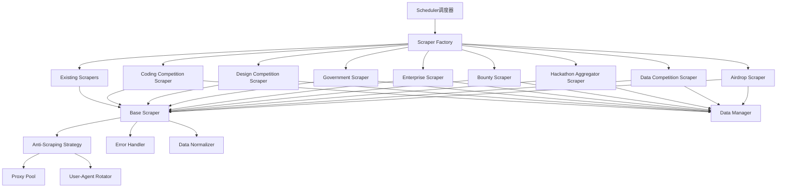

# Design Document: VigilAI信息源扩展

## Overview

本设计文档描述了VigilAI系统信息源扩展功能的技术实现方案。该功能将系统支持的信息源从当前的6个扩展到40+个，涵盖空投聚合、数据竞赛、黑客松聚合、漏洞赏金、企业开发者平台、政府竞赛、设计竞赛和编程竞赛等多个类别。

设计遵循现有的BaseScraper架构，确保所有新爬虫都继承统一的接口和行为模式。同时引入反爬虫策略、增强错误处理机制，并更新调度器以支持新的爬虫类型映射。

### Design Goals

1. **可扩展性**: 新爬虫类设计应易于添加新的信息源
2. **可维护性**: 统一的架构和代码风格，便于长期维护
3. **可靠性**: 完善的错误处理和重试机制，确保爬取稳定性
4. **性能**: 支持并发爬取和智能调度，提高数据获取效率
5. **合规性**: 遵守目标网站的robots.txt和使用条款

## Architecture

### System Architecture



### Component Hierarchy


所有爬虫类继承自BaseScraper，形成以下层次结构：

- **BaseScraper** (基类)
  - 定义通用接口: `scrape()`, `parse()`, `normalize()`
  - 提供错误处理和日志记录
  - 集成反爬虫策略
  
- **Specialized Scrapers** (专用爬虫)
  - AirdropScraper: 空投聚合爬虫
  - DataCompetitionScraper: 数据竞赛爬虫
  - HackathonAggregatorScraper: 黑客松聚合爬虫
  - BountyScraper: 漏洞赏金爬虫
  - EnterpriseScraper: 企业开发者平台爬虫
  - GovernmentScraper: 政府竞赛爬虫
  - DesignCompetitionScraper: 设计竞赛爬虫
  - CodingCompetitionScraper: 编程竞赛爬虫

## Components and Interfaces

### 1. BaseScraper Enhancement

BaseScraper需要增强以支持反爬虫策略和更完善的错误处理。

```python
from abc import ABC, abstractmethod
from typing import List, Optional, Dict, Any
import logging
from datetime import datetime
import time
import random

class BaseScraper(ABC):
    """爬虫基类，定义所有爬虫的通用接口"""
    
    def __init__(self, config: Dict[str, Any]):
        self.config = config
        self.source_name = config.get('name', 'Unknown')
        self.source_url = config.get('url', '')
        self.source_type = config.get('type', 'web')
        self.logger = logging.getLogger(f"scraper.{self.source_name}")
        
        # 反爬虫策略组件
        self.proxy_pool = ProxyPool() if config.get('use_proxy', False) else None
        self.user_agent_rotator = UserAgentRotator()
        self.request_delay = config.get('request_delay', (1, 3))  # 随机延迟范围
        
        # 错误处理
        self.max_retries = config.get('max_retries', 3)
        self.retry_count = 0
        self.last_error = None
    
    @abstractmethod
    def scrape(self) -> List[Dict[str, Any]]:
        """抓取数据的主方法，子类必须实现"""
        pass
    
    def get_request_headers(self) -> Dict[str, str]:
        """获取请求头，包含随机User-Agent"""
        return {
            'User-Agent': self.user_agent_rotator.get_random(),
            'Accept': 'text/html,application/xhtml+xml,application/xml;q=0.9,*/*;q=0.8',
            'Accept-Language': 'en-US,en;q=0.5',
            'Accept-Encoding': 'gzip, deflate',
            'Connection': 'keep-alive',
        }
    
    def get_proxy(self) -> Optional[Dict[str, str]]:
        """获取代理配置"""
        if self.proxy_pool:
            return self.proxy_pool.get_random_proxy()
        return None

    
    def add_random_delay(self):
        """在请求之间添加随机延迟"""
        delay = random.uniform(self.request_delay[0], self.request_delay[1])
        time.sleep(delay)
    
    def handle_error(self, error: Exception, context: str = ""):
        """统一的错误处理"""
        self.last_error = error
        self.retry_count += 1
        self.logger.error(f"Error in {self.source_name} ({context}): {str(error)}")
        
        if self.retry_count >= self.max_retries:
            self.logger.error(f"Max retries reached for {self.source_name}")
            return False
        return True
    
    def normalize_activity(self, raw_data: Dict[str, Any]) -> Dict[str, Any]:
        """标准化活动数据"""
        return {
            'title': raw_data.get('title', '').strip(),
            'source': self.source_name,
            'url': raw_data.get('url', ''),
            'deadline': self._normalize_date(raw_data.get('deadline')),
            'description': raw_data.get('description', '').strip(),
            'prize': self._normalize_prize(raw_data.get('prize')),
            'type': raw_data.get('type', self._infer_type()),
            'tags': raw_data.get('tags', []),
            'created_at': datetime.utcnow().isoformat(),
        }
    
    def _normalize_date(self, date_str: Any) -> Optional[str]:
        """标准化日期格式为ISO 8601"""
        # 实现日期解析逻辑
        pass
    
    def _normalize_prize(self, prize_data: Any) -> Optional[str]:
        """标准化奖金信息"""
        # 实现奖金标准化逻辑
        pass
    
    def _infer_type(self) -> str:
        """根据信息源推断活动类型"""
        type_mapping = {
            'airdrop': 'airdrop',
            'competition': 'competition',
            'hackathon': 'hackathon',
            'bounty': 'bounty',
        }
        for key, value in type_mapping.items():
            if key in self.source_name.lower():
                return value
        return 'other'
```

### 2. AirdropScraper (空投聚合爬虫)

处理Airdrops.io、CoinMarketCap、Galxe、DeFiLlama、Zealy等空投平台。

```python
from selenium import webdriver
from selenium.webdriver.common.by import By
from selenium.webdriver.support.ui import WebDriverWait
from selenium.webdriver.support import expected_conditions as EC
from bs4 import BeautifulSoup
import requests

class AirdropScraper(BaseScraper):
    """空投聚合爬虫"""
    
    def __init__(self, config: Dict[str, Any]):
        super().__init__(config)
        self.use_selenium = config.get('use_selenium', False)
        self.driver = None
    
    def scrape(self) -> List[Dict[str, Any]]:
        """抓取空投信息"""
        try:
            if self.use_selenium:
                return self._scrape_dynamic()
            else:
                return self._scrape_static()
        except Exception as e:
            if self.handle_error(e, "scrape"):
                self.add_random_delay()
                return self.scrape()  # 重试
            return []
        finally:
            if self.driver:
                self.driver.quit()

    
    def _scrape_static(self) -> List[Dict[str, Any]]:
        """静态页面抓取（Airdrops.io, DeFiLlama）"""
        headers = self.get_request_headers()
        proxies = self.get_proxy()
        
        response = requests.get(self.source_url, headers=headers, proxies=proxies, timeout=30)
        response.raise_for_status()
        
        soup = BeautifulSoup(response.content, 'html.parser')
        activities = []
        
        # 根据不同平台使用不同的选择器
        if 'airdrops.io' in self.source_url:
            activities = self._parse_airdrops_io(soup)
        elif 'defillama' in self.source_url:
            activities = self._parse_defillama(soup)
        
        self.logger.info(f"Scraped {len(activities)} airdrops from {self.source_name}")
        return [self.normalize_activity(act) for act in activities]
    
    def _scrape_dynamic(self) -> List[Dict[str, Any]]:
        """动态页面抓取（CoinMarketCap, Galxe, Zealy）"""
        options = webdriver.ChromeOptions()
        options.add_argument('--headless')
        options.add_argument(f'user-agent={self.user_agent_rotator.get_random()}')
        
        if self.proxy_pool:
            proxy = self.proxy_pool.get_random_proxy()
            if proxy:
                options.add_argument(f'--proxy-server={proxy["http"]}')
        
        self.driver = webdriver.Chrome(options=options)
        self.driver.get(self.source_url)
        
        # 等待页面加载
        wait = WebDriverWait(self.driver, 10)
        
        activities = []
        if 'coinmarketcap' in self.source_url:
            activities = self._parse_coinmarketcap(self.driver)
        elif 'galxe' in self.source_url:
            activities = self._parse_galxe(self.driver)
        elif 'zealy' in self.source_url:
            activities = self._parse_zealy(self.driver)
        
        return [self.normalize_activity(act) for act in activities]
    
    def _parse_airdrops_io(self, soup: BeautifulSoup) -> List[Dict[str, Any]]:
        """解析Airdrops.io页面"""
        activities = []
        airdrop_cards = soup.select('.airdrop-card')  # 示例选择器
        
        for card in airdrop_cards:
            try:
                activity = {
                    'title': card.select_one('.title').text.strip(),
                    'url': card.select_one('a')['href'],
                    'description': card.select_one('.description').text.strip(),
                    'prize': card.select_one('.reward').text.strip(),
                    'deadline': card.select_one('.deadline').text.strip(),
                    'type': 'airdrop',
                }
                activities.append(activity)
            except Exception as e:
                self.logger.warning(f"Failed to parse airdrop card: {e}")
                continue
        
        return activities
    
    def _parse_coinmarketcap(self, driver) -> List[Dict[str, Any]]:
        """解析CoinMarketCap空投页面（动态）"""
        activities = []
        # 等待空投列表加载
        wait = WebDriverWait(driver, 10)
        wait.until(EC.presence_of_element_located((By.CLASS_NAME, 'airdrop-item')))
        
        airdrop_elements = driver.find_elements(By.CLASS_NAME, 'airdrop-item')
        
        for element in airdrop_elements:
            try:
                activity = {
                    'title': element.find_element(By.CLASS_NAME, 'title').text,
                    'url': element.find_element(By.TAG_NAME, 'a').get_attribute('href'),
                    'description': element.find_element(By.CLASS_NAME, 'description').text,
                    'prize': element.find_element(By.CLASS_NAME, 'reward').text,
                    'type': 'airdrop',
                }
                activities.append(activity)
            except Exception as e:
                self.logger.warning(f"Failed to parse CMC airdrop: {e}")
                continue
        
        return activities
```

### 3. DataCompetitionScraper (数据竞赛爬虫)

处理天池、DataFountain、DataCastle、DrivenData等数据竞赛平台。


```python
class DataCompetitionScraper(BaseScraper):
    """数据竞赛爬虫"""
    
    def scrape(self) -> List[Dict[str, Any]]:
        """抓取数据竞赛信息"""
        try:
            headers = self.get_request_headers()
            proxies = self.get_proxy()
            
            response = requests.get(self.source_url, headers=headers, proxies=proxies, timeout=30)
            response.raise_for_status()
            
            # 处理中文编码
            response.encoding = response.apparent_encoding
            
            soup = BeautifulSoup(response.content, 'html.parser')
            activities = []
            
            if 'tianchi' in self.source_url or '天池' in self.source_name:
                activities = self._parse_tianchi(soup)
            elif 'datafountain' in self.source_url:
                activities = self._parse_datafountain(soup)
            elif 'datacastle' in self.source_url:
                activities = self._parse_datacastle(soup)
            elif 'drivendata' in self.source_url:
                activities = self._parse_drivendata(soup)
            
            self.logger.info(f"Scraped {len(activities)} competitions from {self.source_name}")
            return [self.normalize_activity(act) for act in activities]
            
        except Exception as e:
            if self.handle_error(e, "scrape"):
                self.add_random_delay()
                return self.scrape()
            return []
    
    def _parse_tianchi(self, soup: BeautifulSoup) -> List[Dict[str, Any]]:
        """解析天池竞赛页面"""
        activities = []
        competition_items = soup.select('.competition-item')
        
        for item in competition_items:
            try:
                activity = {
                    'title': item.select_one('.title').text.strip(),
                    'url': 'https://tianchi.aliyun.com' + item.select_one('a')['href'],
                    'prize': item.select_one('.prize').text.strip(),
                    'deadline': item.select_one('.deadline').text.strip(),
                    'description': item.select_one('.description').text.strip(),
                    'type': 'competition',
                    'tags': ['data-science', 'tianchi'],
                }
                activities.append(activity)
            except Exception as e:
                self.logger.warning(f"Failed to parse Tianchi competition: {e}")
                continue
        
        return activities
```

### 4. HackathonAggregatorScraper (黑客松聚合爬虫)

处理MLH、Hackathon.com等黑客松聚合平台。

```python
class HackathonAggregatorScraper(BaseScraper):
    """黑客松聚合爬虫"""
    
    def scrape(self) -> List[Dict[str, Any]]:
        """抓取黑客松信息"""
        try:
            headers = self.get_request_headers()
            proxies = self.get_proxy()
            
            response = requests.get(self.source_url, headers=headers, proxies=proxies, timeout=30)
            response.raise_for_status()
            
            soup = BeautifulSoup(response.content, 'html.parser')
            activities = []
            
            if 'mlh.io' in self.source_url:
                activities = self._parse_mlh(soup)
            elif 'hackathon.com' in self.source_url:
                activities = self._parse_hackathon_com(soup)
            
            # 过滤已结束的活动
            current_time = datetime.utcnow()
            activities = [act for act in activities if self._is_active(act, current_time)]
            
            self.logger.info(f"Scraped {len(activities)} hackathons from {self.source_name}")
            return [self.normalize_activity(act) for act in activities]
            
        except Exception as e:
            if self.handle_error(e, "scrape"):
                self.add_random_delay()
                return self.scrape()
            return []
    
    def _is_active(self, activity: Dict[str, Any], current_time: datetime) -> bool:
        """检查活动是否仍然有效"""
        deadline_str = activity.get('deadline')
        if not deadline_str:
            return True  # 如果没有截止日期，保留
        
        try:
            deadline = datetime.fromisoformat(deadline_str)
            return deadline > current_time
        except:
            return True  # 解析失败时保留
```

### 5. BountyScraper (漏洞赏金爬虫)

处理HackerOne、Bugcrowd、Code4rena、IssueHunt、Bountysource等漏洞赏金平台。


```python
class BountyScraper(BaseScraper):
    """漏洞赏金爬虫"""
    
    def scrape(self) -> List[Dict[str, Any]]:
        """抓取漏洞赏金信息"""
        try:
            headers = self.get_request_headers()
            proxies = self.get_proxy()
            
            response = requests.get(self.source_url, headers=headers, proxies=proxies, timeout=30)
            response.raise_for_status()
            
            soup = BeautifulSoup(response.content, 'html.parser')
            activities = []
            
            if 'hackerone' in self.source_url:
                activities = self._parse_hackerone(soup)
            elif 'bugcrowd' in self.source_url:
                activities = self._parse_bugcrowd(soup)
            elif 'code4rena' in self.source_url:
                activities = self._parse_code4rena(soup)
            elif 'issuehunt' in self.source_url:
                activities = self._parse_issuehunt(soup)
            elif 'bountysource' in self.source_url:
                activities = self._parse_bountysource(soup)
            
            self.logger.info(f"Scraped {len(activities)} bounties from {self.source_name}")
            return [self.normalize_activity(act) for act in activities]
            
        except Exception as e:
            if self.handle_error(e, "scrape"):
                self.add_random_delay()
                return self.scrape()
            return []
    
    def _parse_code4rena(self, soup: BeautifulSoup) -> List[Dict[str, Any]]:
        """解析Code4rena智能合约审计竞赛"""
        activities = []
        contest_items = soup.select('.contest-item')
        
        for item in contest_items:
            try:
                activity = {
                    'title': item.select_one('.title').text.strip(),
                    'url': item.select_one('a')['href'],
                    'prize': item.select_one('.prize-pool').text.strip(),
                    'deadline': item.select_one('.end-time').text.strip(),
                    'description': item.select_one('.description').text.strip(),
                    'type': 'bounty',
                    'tags': ['smart-contract', 'audit', 'web3'],
                }
                activities.append(activity)
            except Exception as e:
                self.logger.warning(f"Failed to parse Code4rena contest: {e}")
                continue
        
        return activities
```

### 6. EnterpriseScraper (企业开发者平台爬虫)

处理华为、Google、AWS、Microsoft等企业开发者平台。

```python
class EnterpriseScraper(BaseScraper):
    """企业开发者平台爬虫"""
    
    def scrape(self) -> List[Dict[str, Any]]:
        """抓取企业开发者竞赛信息"""
        try:
            # 优先使用API
            if self.config.get('api_url'):
                return self._scrape_api()
            else:
                return self._scrape_web()
                
        except Exception as e:
            if self.handle_error(e, "scrape"):
                self.add_random_delay()
                return self.scrape()
            return []
    
    def _scrape_api(self) -> List[Dict[str, Any]]:
        """使用官方API抓取"""
        headers = self.get_request_headers()
        api_key = self.config.get('api_key')
        if api_key:
            headers['Authorization'] = f'Bearer {api_key}'
        
        response = requests.get(self.config['api_url'], headers=headers, timeout=30)
        response.raise_for_status()
        
        data = response.json()
        activities = self._parse_api_response(data)
        
        self.logger.info(f"Scraped {len(activities)} activities from {self.source_name} API")
        return [self.normalize_activity(act) for act in activities]
    
    def _scrape_web(self) -> List[Dict[str, Any]]:
        """网页抓取"""
        headers = self.get_request_headers()
        proxies = self.get_proxy()
        
        response = requests.get(self.source_url, headers=headers, proxies=proxies, timeout=30)
        response.raise_for_status()
        
        soup = BeautifulSoup(response.content, 'html.parser')
        activities = []
        
        if 'huawei' in self.source_url or '华为' in self.source_name:
            activities = self._parse_huawei(soup)
        elif 'google' in self.source_url:
            activities = self._parse_google(soup)
        elif 'aws' in self.source_url:
            activities = self._parse_aws(soup)
        elif 'microsoft' in self.source_url:
            activities = self._parse_microsoft(soup)
        
        return [self.normalize_activity(act) for act in activities]
```

### 7. GovernmentScraper (政府竞赛爬虫)

处理Challenge.gov、中国创新创业大赛、创客中国等政府竞赛平台。


```python
class GovernmentScraper(BaseScraper):
    """政府竞赛爬虫"""
    
    def scrape(self) -> List[Dict[str, Any]]:
        """抓取政府竞赛信息"""
        try:
            headers = self.get_request_headers()
            proxies = self.get_proxy()
            
            response = requests.get(self.source_url, headers=headers, proxies=proxies, timeout=30)
            response.raise_for_status()
            
            # 处理中文编码
            response.encoding = response.apparent_encoding
            
            soup = BeautifulSoup(response.content, 'html.parser')
            activities = []
            
            if 'challenge.gov' in self.source_url:
                activities = self._parse_challenge_gov(soup)
            elif '创新创业' in self.source_name:
                activities = self._parse_innovation_competition(soup)
            elif '创客中国' in self.source_name:
                activities = self._parse_maker_china(soup)
            
            self.logger.info(f"Scraped {len(activities)} government competitions from {self.source_name}")
            return [self.normalize_activity(act) for act in activities]
            
        except Exception as e:
            if self.handle_error(e, "scrape"):
                self.add_random_delay()
                return self.scrape()
            return []
```

### 8. DesignCompetitionScraper (设计竞赛爬虫)

处理设计竞赛网等设计竞赛平台。

```python
class DesignCompetitionScraper(BaseScraper):
    """设计竞赛爬虫"""
    
    def scrape(self) -> List[Dict[str, Any]]:
        """抓取设计竞赛信息"""
        try:
            headers = self.get_request_headers()
            proxies = self.get_proxy()
            
            response = requests.get(self.source_url, headers=headers, proxies=proxies, timeout=30)
            response.raise_for_status()
            
            response.encoding = response.apparent_encoding
            
            soup = BeautifulSoup(response.content, 'html.parser')
            activities = self._parse_design_competitions(soup)
            
            self.logger.info(f"Scraped {len(activities)} design competitions from {self.source_name}")
            return [self.normalize_activity(act) for act in activities]
            
        except Exception as e:
            if self.handle_error(e, "scrape"):
                self.add_random_delay()
                return self.scrape()
            return []
    
    def _parse_design_competitions(self, soup: BeautifulSoup) -> List[Dict[str, Any]]:
        """解析设计竞赛"""
        activities = []
        competition_items = soup.select('.competition-item')
        
        for item in competition_items:
            try:
                activity = {
                    'title': item.select_one('.title').text.strip(),
                    'url': item.select_one('a')['href'],
                    'prize': item.select_one('.prize').text.strip(),
                    'deadline': item.select_one('.deadline').text.strip(),
                    'description': item.select_one('.description').text.strip(),
                    'type': 'competition',
                    'tags': self._extract_design_type(item),
                }
                activities.append(activity)
            except Exception as e:
                self.logger.warning(f"Failed to parse design competition: {e}")
                continue
        
        return activities
    
    def _extract_design_type(self, item) -> List[str]:
        """提取设计类型标签"""
        tags = ['design']
        type_text = item.select_one('.type').text.lower() if item.select_one('.type') else ''
        
        if 'ui' in type_text or 'ux' in type_text:
            tags.append('ui-ux')
        if '平面' in type_text or 'graphic' in type_text:
            tags.append('graphic-design')
        if '工业' in type_text or 'industrial' in type_text:
            tags.append('industrial-design')
        
        return tags
```

### 9. CodingCompetitionScraper (编程竞赛爬虫)

处理HackerEarth、TopCoder等编程竞赛平台。


```python
class CodingCompetitionScraper(BaseScraper):
    """编程竞赛爬虫"""
    
    def scrape(self) -> List[Dict[str, Any]]:
        """抓取编程竞赛信息"""
        try:
            headers = self.get_request_headers()
            proxies = self.get_proxy()
            
            response = requests.get(self.source_url, headers=headers, proxies=proxies, timeout=30)
            response.raise_for_status()
            
            soup = BeautifulSoup(response.content, 'html.parser')
            activities = []
            
            if 'hackerearth' in self.source_url:
                activities = self._parse_hackerearth(soup)
            elif 'topcoder' in self.source_url:
                activities = self._parse_topcoder(soup)
            
            self.logger.info(f"Scraped {len(activities)} coding competitions from {self.source_name}")
            return [self.normalize_activity(act) for act in activities]
            
        except Exception as e:
            if self.handle_error(e, "scrape"):
                self.add_random_delay()
                return self.scrape()
            return []
    
    def _parse_topcoder(self, soup: BeautifulSoup) -> List[Dict[str, Any]]:
        """解析TopCoder竞赛"""
        activities = []
        challenge_items = soup.select('.challenge-item')
        
        for item in challenge_items:
            try:
                # 提取竞赛类型（SRM或Marathon）
                challenge_type = item.select_one('.type').text.strip()
                
                activity = {
                    'title': item.select_one('.title').text.strip(),
                    'url': item.select_one('a')['href'],
                    'prize': item.select_one('.prize').text.strip(),
                    'deadline': item.select_one('.end-time').text.strip(),
                    'description': item.select_one('.description').text.strip(),
                    'type': 'competition',
                    'tags': ['coding', 'algorithm', challenge_type.lower()],
                }
                
                # 标记正在进行的竞赛
                if item.select_one('.status.active'):
                    activity['tags'].append('active')
                
                activities.append(activity)
            except Exception as e:
                self.logger.warning(f"Failed to parse TopCoder challenge: {e}")
                continue
        
        return activities
```

### 10. Anti-Scraping Strategy Components

反爬虫策略的核心组件。

```python
class ProxyPool:
    """代理池管理"""
    
    def __init__(self, proxy_list: Optional[List[str]] = None):
        self.proxies = proxy_list or []
        self.failed_proxies = set()
        self.current_index = 0
    
    def get_random_proxy(self) -> Optional[Dict[str, str]]:
        """获取随机代理"""
        available_proxies = [p for p in self.proxies if p not in self.failed_proxies]
        
        if not available_proxies:
            return None
        
        proxy = random.choice(available_proxies)
        return {
            'http': proxy,
            'https': proxy,
        }
    
    def mark_failed(self, proxy: str):
        """标记失败的代理"""
        self.failed_proxies.add(proxy)
    
    def reset_failed(self):
        """重置失败代理列表"""
        self.failed_proxies.clear()


class UserAgentRotator:
    """User-Agent轮换器"""
    
    def __init__(self):
        self.user_agents = [
            'Mozilla/5.0 (Windows NT 10.0; Win64; x64) AppleWebKit/537.36 (KHTML, like Gecko) Chrome/120.0.0.0 Safari/537.36',
            'Mozilla/5.0 (Windows NT 10.0; Win64; x64; rv:121.0) Gecko/20100101 Firefox/121.0',
            'Mozilla/5.0 (Macintosh; Intel Mac OS X 10_15_7) AppleWebKit/537.36 (KHTML, like Gecko) Chrome/120.0.0.0 Safari/537.36',
            'Mozilla/5.0 (Macintosh; Intel Mac OS X 10_15_7) AppleWebKit/605.1.15 (KHTML, like Gecko) Version/17.1 Safari/605.1.15',
            'Mozilla/5.0 (X11; Linux x86_64) AppleWebKit/537.36 (KHTML, like Gecko) Chrome/120.0.0.0 Safari/537.36',
        ]
    
    def get_random(self) -> str:
        """获取随机User-Agent"""
        return random.choice(self.user_agents)
```

### 11. Scheduler Updates

更新调度器以支持新的爬虫类型映射。


```python
# scheduler.py 更新

from scrapers.airdrop_scraper import AirdropScraper
from scrapers.data_competition_scraper import DataCompetitionScraper
from scrapers.hackathon_aggregator_scraper import HackathonAggregatorScraper
from scrapers.bounty_scraper import BountyScraper
from scrapers.enterprise_scraper import EnterpriseScraper
from scrapers.government_scraper import GovernmentScraper
from scrapers.design_competition_scraper import DesignCompetitionScraper
from scrapers.coding_competition_scraper import CodingCompetitionScraper

class Scheduler:
    """调度器，负责管理和调度所有爬虫"""
    
    def __init__(self):
        # 爬虫类型映射
        self.scraper_classes = {
            'rss': RssScraper,
            'web': WebScraper,
            'web3': Web3Scraper,
            'kaggle': KaggleScraper,
            'tech_media': TechMediaScraper,
            'airdrop': AirdropScraper,
            'data_competition': DataCompetitionScraper,
            'hackathon_aggregator': HackathonAggregatorScraper,
            'bounty': BountyScraper,
            'enterprise': EnterpriseScraper,
            'government': GovernmentScraper,
            'design_competition': DesignCompetitionScraper,
            'coding_competition': CodingCompetitionScraper,
        }
        
        self.sources = self._load_sources()
        self.scraper_states = {}  # 跟踪每个爬虫的状态
    
    def register_scraper(self, scraper_type: str, scraper_class):
        """动态注册新的爬虫类型"""
        self.scraper_classes[scraper_type] = scraper_class
    
    def create_scraper(self, source_config: Dict[str, Any]) -> BaseScraper:
        """根据配置创建爬虫实例"""
        scraper_type = source_config.get('type', 'web')
        scraper_class = self.scraper_classes.get(scraper_type)
        
        if not scraper_class:
            raise ValueError(f"Unknown scraper type: {scraper_type}")
        
        return scraper_class(source_config)
    
    def schedule_scraper(self, source_name: str):
        """调度单个爬虫"""
        source_config = next((s for s in self.sources if s['name'] == source_name), None)
        
        if not source_config:
            logger.error(f"Source not found: {source_name}")
            return
        
        # 检查爬虫状态
        state = self.scraper_states.get(source_name, {})
        error_count = state.get('error_count', 0)
        
        # 如果连续失败3次，暂停30分钟
        if error_count >= 3:
            last_error_time = state.get('last_error_time')
            if last_error_time and (datetime.utcnow() - last_error_time).seconds < 1800:
                logger.warning(f"Scraper {source_name} is paused due to repeated failures")
                return
            else:
                # 重置错误计数
                state['error_count'] = 0
        
        try:
            scraper = self.create_scraper(source_config)
            activities = scraper.scrape()
            
            # 保存活动数据
            self.data_manager.save_activities(activities)
            
            # 更新状态
            self.scraper_states[source_name] = {
                'last_run': datetime.utcnow(),
                'error_count': 0,
                'last_activity_count': len(activities),
            }
            
            logger.info(f"Successfully scraped {len(activities)} activities from {source_name}")
            
        except Exception as e:
            logger.error(f"Error scraping {source_name}: {e}")
            
            # 更新错误状态
            state['error_count'] = error_count + 1
            state['last_error_time'] = datetime.utcnow()
            state['last_error'] = str(e)
            self.scraper_states[source_name] = state
            
            # 发送告警
            if state['error_count'] >= 3:
                self._send_alert(source_name, state)
    
    def _send_alert(self, source_name: str, state: Dict[str, Any]):
        """发送告警通知"""
        logger.critical(f"ALERT: Scraper {source_name} has failed {state['error_count']} times. Last error: {state['last_error']}")
```

## Data Models

活动数据模型保持不变，但需要确保所有新爬虫都返回标准化的Activity对象。

```python
from dataclasses import dataclass
from typing import Optional, List
from datetime import datetime

@dataclass
class Activity:
    """活动数据模型"""
    title: str
    source: str
    url: str
    deadline: Optional[str]
    description: str
    prize: Optional[str]
    type: str  # hackathon, competition, bounty, airdrop, other
    tags: List[str]
    created_at: str
    updated_at: Optional[str] = None
    
    def to_dict(self) -> dict:
        """转换为字典"""
        return {
            'title': self.title,
            'source': self.source,
            'url': self.url,
            'deadline': self.deadline,
            'description': self.description,
            'prize': self.prize,
            'type': self.type,
            'tags': self.tags,
            'created_at': self.created_at,
            'updated_at': self.updated_at,
        }
```


## Correctness Properties

*A property is a characteristic or behavior that should hold true across all valid executions of a system—essentially, a formal statement about what the system should do. Properties serve as the bridge between human-readable specifications and machine-verifiable correctness guarantees.*

### Property 1: Scraper Output Standardization

*For any* scraper instance and any successful scrape operation, all returned Activity objects SHALL contain the required fields (title, source, url) and conform to the Activity data model structure.

**Validates: Requirements 10.3, 14.1, 14.2**

### Property 2: Field Extraction Completeness

*For any* scraper type (airdrop, data_competition, hackathon_aggregator, bounty, enterprise, government, design_competition, coding_competition), when scraping returns activities, each activity SHALL contain the type-specific required fields as defined in the requirements.

**Validates: Requirements 1.1, 1.3, 1.4, 1.5, 2.1, 2.3, 2.4, 3.1, 3.2, 3.3, 4.1, 4.2, 4.3, 4.4, 4.5, 5.1, 5.2, 5.3, 5.4, 6.1, 6.2, 6.3, 7.1, 7.2, 8.1, 8.2, 9.2, 9.3, 9.4**

### Property 3: Expired Activity Filtering

*For any* hackathon aggregator scraper, when the current time is after an activity's deadline, that activity SHALL NOT appear in the returned results.

**Validates: Requirements 3.4**

### Property 4: Encoding Handling

*For any* scraper processing content with non-ASCII characters (Chinese, Japanese, etc.), the returned Activity objects SHALL contain correctly decoded text without mojibake or encoding errors.

**Validates: Requirements 2.2, 6.2**

### Property 5: Proxy Rotation

*For any* scraper configured with a proxy pool, consecutive requests SHALL use different proxy IPs selected randomly from the available pool.

**Validates: Requirements 11.1, 11.4**

### Property 6: User-Agent Rotation

*For any* scraper making HTTP requests, each request SHALL include a User-Agent header selected from the predefined list, and consecutive requests SHALL use different User-Agent values.

**Validates: Requirements 1.6, 11.2**

### Property 7: Request Delay

*For any* scraper making consecutive HTTP requests, the time interval between requests SHALL be within the configured delay range (default 1-3 seconds).

**Validates: Requirements 11.3**

### Property 8: Error Recovery and Retry

*For any* scraper encountering a recoverable error (network timeout, temporary failure), the scraper SHALL retry the operation up to the configured maximum retry count before failing permanently.

**Validates: Requirements 12.1**

### Property 9: Error Logging

*For any* scraper encountering an error (network, parsing, timeout), the error SHALL be logged with ERROR level including the error message, source name, and context information.

**Validates: Requirements 12.1, 12.2, 12.4**

### Property 10: Success Logging

*For any* scraper completing a successful scrape operation, the scraper SHALL log an INFO level message containing the source name and the count of activities scraped.

**Validates: Requirements 12.3, 12.4**

### Property 11: Failure Alert Threshold

*For any* scraper that fails consecutively 3 or more times, the scheduler SHALL trigger an alert notification and pause the scraper for 30 minutes.

**Validates: Requirements 11.5, 12.5**

### Property 12: Scraper Initialization

*For any* scraper class, when initialized with a Source_Config dictionary, the scraper SHALL set its source_name, source_url, and source_type attributes from the config.

**Validates: Requirements 10.2**

### Property 13: Scheduler Scraper Type Mapping

*For any* source configuration with a valid scraper type, the scheduler SHALL successfully create an instance of the corresponding scraper class.

**Validates: Requirements 13.1, 13.2**

### Property 14: Dynamic Scraper Registration

*For any* new scraper class registered with the scheduler using register_scraper(), subsequent calls to create_scraper() with that type SHALL successfully instantiate the new scraper class.

**Validates: Requirements 13.4**

### Property 15: Scheduler State Maintenance

*For any* source being scraped, the scheduler SHALL maintain independent state including last_run timestamp, error_count, and last_activity_count.

**Validates: Requirements 13.5**

### Property 16: Date Normalization

*For any* activity with a deadline field, the deadline SHALL be formatted as an ISO 8601 string or None if no deadline exists.

**Validates: Requirements 14.3**

### Property 17: Currency Standardization

*For any* activity with a prize field containing currency information, the prize string SHALL include a standardized currency code (USD, CNY, ETH, etc.) or be None if no prize exists.

**Validates: Requirements 14.4**

### Property 18: Activity Type Inference

*For any* activity where the type is not explicitly provided, the scraper SHALL infer the type (hackathon, competition, bounty, airdrop, other) based on the source name or content.

**Validates: Requirements 14.5**

### Property 19: Multi-Stage Competition Parsing

*For any* design competition with multiple stages, the scraper SHALL extract and record the deadline for each stage in the activity data.

**Validates: Requirements 7.3**

### Property 20: Active Competition Status Marking

*For any* coding competition that is currently ongoing, the scraper SHALL include an 'active' tag in the activity's tags list.

**Validates: Requirements 8.3**

## Error Handling

### Error Categories

1. **Network Errors**
   - Connection timeout
   - DNS resolution failure
   - HTTP error codes (4xx, 5xx)
   - Proxy connection failure

2. **Parsing Errors**
   - Invalid HTML structure
   - Missing expected elements
   - Malformed data

3. **Data Validation Errors**
   - Missing required fields
   - Invalid date formats
   - Encoding issues

### Error Handling Strategy


```python
class ErrorHandler:
    """统一的错误处理器"""
    
    @staticmethod
    def handle_network_error(error: Exception, scraper_name: str, url: str) -> bool:
        """处理网络错误"""
        logger.error(f"Network error in {scraper_name} for URL {url}: {str(error)}")
        
        # 判断是否可重试
        if isinstance(error, (requests.Timeout, requests.ConnectionError)):
            return True  # 可重试
        elif isinstance(error, requests.HTTPError):
            status_code = error.response.status_code
            # 5xx错误可重试，4xx错误不重试
            return 500 <= status_code < 600
        
        return False
    
    @staticmethod
    def handle_parsing_error(error: Exception, scraper_name: str, html_snippet: str):
        """处理解析错误"""
        logger.error(f"Parsing error in {scraper_name}: {str(error)}")
        logger.debug(f"HTML snippet: {html_snippet[:500]}")  # 记录前500字符
    
    @staticmethod
    def handle_validation_error(error: Exception, scraper_name: str, data: dict):
        """处理数据验证错误"""
        logger.warning(f"Validation error in {scraper_name}: {str(error)}")
        logger.debug(f"Invalid data: {data}")
```

### Retry Mechanism

```python
def scrape_with_retry(scraper: BaseScraper, max_retries: int = 3) -> List[Dict[str, Any]]:
    """带重试机制的爬取函数"""
    for attempt in range(max_retries):
        try:
            return scraper.scrape()
        except Exception as e:
            is_retryable = ErrorHandler.handle_network_error(e, scraper.source_name, scraper.source_url)
            
            if not is_retryable or attempt == max_retries - 1:
                logger.error(f"Failed to scrape {scraper.source_name} after {attempt + 1} attempts")
                return []
            
            # 指数退避
            wait_time = 2 ** attempt
            logger.info(f"Retrying {scraper.source_name} in {wait_time} seconds...")
            time.sleep(wait_time)
    
    return []
```

### Graceful Degradation

当爬虫遇到错误时，系统应该优雅降级：

1. **部分数据返回**: 如果部分活动解析失败，返回成功解析的活动
2. **默认值填充**: 对于非必填字段，使用None或空列表作为默认值
3. **错误记录**: 记录所有错误但不中断整个爬取流程
4. **告警机制**: 连续失败达到阈值时触发告警

## Testing Strategy

### Dual Testing Approach

本项目采用单元测试和属性测试相结合的方式：

- **单元测试**: 验证特定示例、边缘情况和错误条件
- **属性测试**: 验证通用属性在所有输入下的正确性

两者互补，共同确保代码质量。

### Unit Testing

单元测试关注：

1. **特定平台解析**: 为每个平台编写具体的解析测试
2. **边缘情况**: 空数据、缺失字段、异常格式
3. **错误条件**: 网络超时、HTTP错误、解析失败
4. **集成点**: 爬虫与调度器、数据管理器的集成

示例单元测试：

```python
import unittest
from unittest.mock import Mock, patch
from scrapers.airdrop_scraper import AirdropScraper

class TestAirdropScraper(unittest.TestCase):
    
    def setUp(self):
        self.config = {
            'name': 'Airdrops.io',
            'url': 'https://airdrops.io',
            'type': 'airdrop',
        }
        self.scraper = AirdropScraper(self.config)
    
    @patch('requests.get')
    def test_scrape_airdrops_io_success(self, mock_get):
        """测试成功抓取Airdrops.io"""
        mock_response = Mock()
        mock_response.status_code = 200
        mock_response.content = b'''
            <div class="airdrop-card">
                <h3 class="title">Test Airdrop</h3>
                <a href="/airdrop/test">Link</a>
                <p class="description">Test description</p>
                <span class="reward">1000 USDT</span>
                <span class="deadline">2024-12-31</span>
            </div>
        '''
        mock_get.return_value = mock_response
        
        activities = self.scraper.scrape()
        
        self.assertEqual(len(activities), 1)
        self.assertEqual(activities[0]['title'], 'Test Airdrop')
        self.assertEqual(activities[0]['type'], 'airdrop')
    
    @patch('requests.get')
    def test_scrape_network_error(self, mock_get):
        """测试网络错误处理"""
        mock_get.side_effect = requests.Timeout()
        
        activities = self.scraper.scrape()
        
        self.assertEqual(len(activities), 0)
    
    def test_normalize_activity(self):
        """测试活动数据标准化"""
        raw_data = {
            'title': '  Test Airdrop  ',
            'url': 'https://example.com',
            'prize': '1000 USDT',
            'deadline': '2024-12-31',
        }
        
        normalized = self.scraper.normalize_activity(raw_data)
        
        self.assertEqual(normalized['title'], 'Test Airdrop')
        self.assertEqual(normalized['source'], 'Airdrops.io')
        self.assertIn('created_at', normalized)
```

### Property-Based Testing

属性测试使用Python的`hypothesis`库，每个测试运行至少100次以覆盖各种输入。

配置示例：

```python
from hypothesis import given, settings, strategies as st
import hypothesis

# 配置属性测试
hypothesis.settings.register_profile("ci", max_examples=100)
hypothesis.settings.load_profile("ci")
```

属性测试示例：

```python
from hypothesis import given, strategies as st
from scrapers.base import BaseScraper
from models import Activity

class TestScraperProperties:
    
    @given(st.dictionaries(
        keys=st.sampled_from(['name', 'url', 'type']),
        values=st.text(min_size=1, max_size=100)
    ))
    @settings(max_examples=100)
    def test_property_scraper_initialization(self, config):
        """
        Feature: vigilai-sources-expansion, Property 12: Scraper Initialization
        
        For any scraper class, when initialized with a Source_Config dictionary,
        the scraper SHALL set its source_name, source_url, and source_type attributes.
        """
        # 确保必需字段存在
        config.setdefault('name', 'Test')
        config.setdefault('url', 'https://example.com')
        config.setdefault('type', 'web')
        
        scraper = BaseScraper(config)
        
        assert scraper.source_name == config['name']
        assert scraper.source_url == config['url']
        assert scraper.source_type == config['type']
    
    @given(st.lists(st.dictionaries(
        keys=st.sampled_from(['title', 'source', 'url', 'deadline', 'description', 'prize', 'type', 'tags']),
        values=st.one_of(st.text(), st.none(), st.lists(st.text()))
    ), min_size=1, max_size=50))
    @settings(max_examples=100)
    def test_property_output_standardization(self, raw_activities):
        """
        Feature: vigilai-sources-expansion, Property 1: Scraper Output Standardization
        
        For any scraper instance and any successful scrape operation,
        all returned Activity objects SHALL contain the required fields.
        """
        scraper = BaseScraper({'name': 'Test', 'url': 'https://example.com', 'type': 'web'})
        
        # 确保每个活动有必需字段
        for activity in raw_activities:
            activity.setdefault('title', 'Test')
            activity.setdefault('url', 'https://example.com')
        
        normalized = [scraper.normalize_activity(act) for act in raw_activities]
        
        for activity in normalized:
            assert 'title' in activity
            assert 'source' in activity
            assert 'url' in activity
            assert 'created_at' in activity
            assert isinstance(activity['tags'], list)

    
    @given(st.text(min_size=1, max_size=100))
    @settings(max_examples=100)
    def test_property_user_agent_rotation(self, url):
        """
        Feature: vigilai-sources-expansion, Property 6: User-Agent Rotation
        
        For any scraper making HTTP requests, each request SHALL include
        a User-Agent header selected from the predefined list.
        """
        scraper = BaseScraper({'name': 'Test', 'url': url, 'type': 'web'})
        
        user_agents = set()
        for _ in range(10):
            headers = scraper.get_request_headers()
            assert 'User-Agent' in headers
            user_agents.add(headers['User-Agent'])
        
        # 至少应该有2个不同的User-Agent（如果列表有多个）
        assert len(user_agents) >= 1
    
    @given(st.lists(st.dictionaries(
        keys=st.sampled_from(['title', 'deadline']),
        values=st.text()
    ), min_size=5, max_size=20))
    @settings(max_examples=100)
    def test_property_expired_activity_filtering(self, activities):
        """
        Feature: vigilai-sources-expansion, Property 3: Expired Activity Filtering
        
        For any hackathon aggregator scraper, when the current time is after
        an activity's deadline, that activity SHALL NOT appear in the returned results.
        """
        from datetime import datetime, timedelta
        
        # 设置一些活动为过期，一些为未过期
        current_time = datetime.utcnow()
        for i, activity in enumerate(activities):
            if i % 2 == 0:
                # 过期活动
                activity['deadline'] = (current_time - timedelta(days=1)).isoformat()
            else:
                # 未过期活动
                activity['deadline'] = (current_time + timedelta(days=1)).isoformat()
        
        scraper = HackathonAggregatorScraper({
            'name': 'Test',
            'url': 'https://example.com',
            'type': 'hackathon_aggregator'
        })
        
        # 过滤过期活动
        filtered = [act for act in activities if scraper._is_active(act, current_time)]
        
        # 验证所有返回的活动都未过期
        for activity in filtered:
            deadline = datetime.fromisoformat(activity['deadline'])
            assert deadline > current_time
    
    @given(st.text(min_size=1, max_size=1000, alphabet=st.characters(
        blacklist_categories=('Cs',), 
        whitelist_categories=('L',)  # 包含各种语言字符
    )))
    @settings(max_examples=100)
    def test_property_encoding_handling(self, text_content):
        """
        Feature: vigilai-sources-expansion, Property 4: Encoding Handling
        
        For any scraper processing content with non-ASCII characters,
        the returned Activity objects SHALL contain correctly decoded text.
        """
        scraper = DataCompetitionScraper({
            'name': 'Test',
            'url': 'https://example.com',
            'type': 'data_competition'
        })
        
        activity = {
            'title': text_content,
            'url': 'https://example.com',
            'description': text_content,
        }
        
        normalized = scraper.normalize_activity(activity)
        
        # 验证文本可以正常编码和解码
        assert normalized['title'].encode('utf-8').decode('utf-8') == text_content
        assert normalized['description'].encode('utf-8').decode('utf-8') == text_content
    
    @given(st.integers(min_value=1, max_value=10))
    @settings(max_examples=100)
    def test_property_scheduler_state_maintenance(self, activity_count):
        """
        Feature: vigilai-sources-expansion, Property 15: Scheduler State Maintenance
        
        For any source being scraped, the scheduler SHALL maintain independent state
        including last_run timestamp, error_count, and last_activity_count.
        """
        scheduler = Scheduler()
        source_name = 'Test Source'
        
        # 模拟成功的爬取
        scheduler.scraper_states[source_name] = {
            'last_run': datetime.utcnow(),
            'error_count': 0,
            'last_activity_count': activity_count,
        }
        
        state = scheduler.scraper_states[source_name]
        
        assert 'last_run' in state
        assert 'error_count' in state
        assert 'last_activity_count' in state
        assert state['last_activity_count'] == activity_count
```

### Test Coverage Requirements

- 所有新爬虫类必须有单元测试覆盖率 >= 80%
- 核心组件（BaseScraper, Scheduler, Anti-Scraping Strategy）必须有覆盖率 >= 90%
- 每个correctness property必须有对应的属性测试
- 所有属性测试必须运行至少100次迭代

### Integration Testing

集成测试验证组件之间的交互：

```python
class TestIntegration(unittest.TestCase):
    
    def test_scheduler_creates_correct_scraper(self):
        """测试调度器创建正确的爬虫类型"""
        scheduler = Scheduler()
        
        config = {
            'name': 'Test Airdrop',
            'url': 'https://airdrops.io',
            'type': 'airdrop',
        }
        
        scraper = scheduler.create_scraper(config)
        
        self.assertIsInstance(scraper, AirdropScraper)
    
    def test_end_to_end_scraping(self):
        """端到端测试：从调度到数据保存"""
        scheduler = Scheduler()
        
        # 使用mock数据
        with patch('requests.get') as mock_get:
            mock_response = Mock()
            mock_response.status_code = 200
            mock_response.content = b'<div class="airdrop-card">...</div>'
            mock_get.return_value = mock_response
            
            scheduler.schedule_scraper('Airdrops.io')
            
            # 验证数据已保存
            activities = scheduler.data_manager.get_activities(source='Airdrops.io')
            self.assertGreater(len(activities), 0)
```

### Mock Data Strategy

为了避免依赖外部网站，测试使用mock数据：

1. **HTML Fixtures**: 保存真实网站的HTML快照用于测试
2. **Mock HTTP Responses**: 使用unittest.mock模拟HTTP请求
3. **Test Data Generators**: 使用hypothesis生成测试数据

### Continuous Integration

测试应该在CI/CD流程中自动运行：

```yaml
# .github/workflows/test.yml
name: Test

on: [push, pull_request]

jobs:
  test:
    runs-on: windows-latest
    
    steps:
    - uses: actions/checkout@v2
    
    - name: Set up Python
      uses: actions/setup-python@v2
      with:
        python-version: '3.11'
    
    - name: Install dependencies
      run: |
        python -m pip install --upgrade pip
        pip install -r requirements.txt
        pip install pytest pytest-cov hypothesis
    
    - name: Run unit tests
      run: pytest tests/ --cov=scrapers --cov-report=xml
    
    - name: Run property tests
      run: pytest tests/property_tests/ --hypothesis-profile=ci
    
    - name: Upload coverage
      uses: codecov/codecov-action@v2
```

## Implementation Notes

### Dependencies

新增依赖项：

```
selenium>=4.15.0
playwright>=1.40.0
beautifulsoup4>=4.12.0
requests>=2.31.0
hypothesis>=6.92.0  # 属性测试
pytest>=7.4.0
pytest-cov>=4.1.0
```

### Configuration Updates

config.py已经包含40+个信息源配置，需要确保每个配置都有正确的type字段：

```python
SOURCES = [
    # 空投聚合
    {'name': 'Airdrops.io', 'url': 'https://airdrops.io', 'type': 'airdrop', 'priority': 'high'},
    {'name': 'CMC Airdrops', 'url': 'https://coinmarketcap.com/airdrop/', 'type': 'airdrop', 'priority': 'high', 'use_selenium': True},
    {'name': 'Galxe', 'url': 'https://galxe.com', 'type': 'airdrop', 'priority': 'high', 'use_selenium': True},
    
    # 数据竞赛
    {'name': '天池', 'url': 'https://tianchi.aliyun.com/competition/activeList', 'type': 'data_competition', 'priority': 'medium'},
    {'name': 'DataFountain', 'url': 'https://www.datafountain.cn/competitions', 'type': 'data_competition', 'priority': 'medium'},
    
    # 黑客松聚合
    {'name': 'MLH', 'url': 'https://mlh.io/seasons/2024/events', 'type': 'hackathon_aggregator', 'priority': 'high'},
    {'name': 'Hackathon.com', 'url': 'https://www.hackathon.com', 'type': 'hackathon_aggregator', 'priority': 'high'},
    
    # 漏洞赏金
    {'name': 'HackerOne', 'url': 'https://hackerone.com/directory/programs', 'type': 'bounty', 'priority': 'medium'},
    {'name': 'Code4rena', 'url': 'https://code4rena.com/contests', 'type': 'bounty', 'priority': 'medium'},
    
    # 企业平台
    {'name': '华为开发者', 'url': 'https://developer.huawei.com/consumer/cn/activity/', 'type': 'enterprise', 'priority': 'medium'},
    {'name': 'Google Developers', 'url': 'https://developers.google.com/community/competitions', 'type': 'enterprise', 'priority': 'medium'},
    
    # 政府竞赛
    {'name': 'Challenge.gov', 'url': 'https://www.challenge.gov', 'type': 'government', 'priority': 'low'},
    
    # 设计竞赛
    {'name': '设计竞赛网', 'url': 'http://www.designcontest.cn', 'type': 'design_competition', 'priority': 'low'},
    
    # 编程竞赛
    {'name': 'HackerEarth', 'url': 'https://www.hackerearth.com/challenges/', 'type': 'coding_competition', 'priority': 'medium'},
    {'name': 'TopCoder', 'url': 'https://www.topcoder.com/challenges', 'type': 'coding_competition', 'priority': 'medium'},
]
```

### File Structure

新增文件：

```
app/backend/
├── scrapers/
│   ├── __init__.py
│   ├── base.py (已存在，需增强)
│   ├── airdrop_scraper.py (新增)
│   ├── data_competition_scraper.py (新增)
│   ├── hackathon_aggregator_scraper.py (新增)
│   ├── bounty_scraper.py (新增)
│   ├── enterprise_scraper.py (新增)
│   ├── government_scraper.py (新增)
│   ├── design_competition_scraper.py (新增)
│   └── coding_competition_scraper.py (新增)
├── utils/
│   ├── __init__.py
│   ├── proxy_pool.py (新增)
│   ├── user_agent_rotator.py (新增)
│   └── error_handler.py (新增)
├── tests/
│   ├── test_airdrop_scraper.py (新增)
│   ├── test_data_competition_scraper.py (新增)
│   ├── test_hackathon_aggregator_scraper.py (新增)
│   ├── test_bounty_scraper.py (新增)
│   ├── test_enterprise_scraper.py (新增)
│   ├── test_government_scraper.py (新增)
│   ├── test_design_competition_scraper.py (新增)
│   ├── test_coding_competition_scraper.py (新增)
│   ├── test_anti_scraping.py (新增)
│   └── property_tests/
│       ├── __init__.py
│       ├── test_scraper_properties.py (新增)
│       └── test_scheduler_properties.py (新增)
├── scheduler.py (需更新)
└── config.py (已更新)
```

### Performance Considerations

1. **并发爬取**: 使用asyncio或线程池并发爬取多个信息源
2. **缓存机制**: 对于更新频率低的信息源，实现缓存以减少请求
3. **增量更新**: 只抓取新增或更新的活动，避免重复抓取
4. **资源限制**: 限制并发数和请求频率，避免过载

### Security Considerations

1. **输入验证**: 验证所有从网页抓取的数据，防止XSS和注入攻击
2. **代理安全**: 使用可信的代理服务，避免数据泄露
3. **凭证管理**: API密钥等敏感信息使用环境变量存储
4. **日志脱敏**: 日志中不记录敏感信息（密码、token等）

## Summary

本设计文档定义了VigilAI信息源扩展功能的完整技术方案，包括：

- 8个新爬虫类的实现（空投、数据竞赛、黑客松聚合、漏洞赏金、企业平台、政府竞赛、设计竞赛、编程竞赛）
- 增强的BaseScraper基类，支持反爬虫策略和错误处理
- 完善的反爬虫策略组件（代理池、User-Agent轮换、请求延迟）
- 更新的调度器，支持新的爬虫类型映射和状态维护
- 20个correctness properties，确保系统正确性
- 双重测试策略（单元测试 + 属性测试），确保代码质量

实现完成后，VigilAI系统将支持40+个高价值信息源，大幅提升用户获取机会信息的能力。
