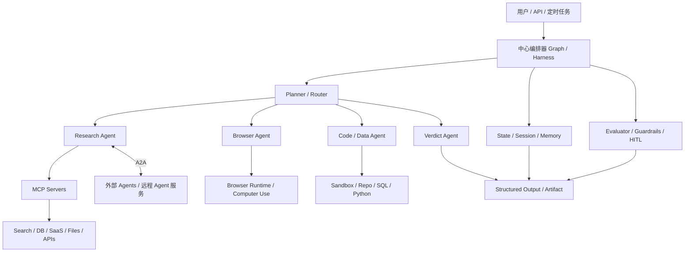

# AI Agent前沿技术调研与架构建议

更新时间：2026-05-15

## 1. 结论

截至 2026 年 5 月，最前沿且真正可落地的 AI Agent 技术路线，已经不是早期那种“自由对话式自治多智能体”。

当前更成熟的主线是：

`中心编排器 / Graph Runtime + MCP 工具协议 + A2A 智能体互通 + 浏览器/代码执行环境 + 可观测/评测 + 人审与权限控制`

这条路线的核心目标不是“让 agent 自己聊起来”，而是：

- 可执行
- 可恢复
- 可审计
- 可评测
- 可控成本
- 可接入真实业务系统

---

## 2. 当前最重要的技术趋势

### 2.1 MCP 正在成为 agent-to-tool 事实标准

MCP 的价值在于统一模型与外部工具、数据源、SaaS、文件系统之间的接入方式。

这意味着后续很多 Agent 系统不会再为每个框架单独写一套工具适配层，而会优先对接 MCP。

判断：

- MCP 现在不是“可选加分项”
- MCP 正在变成 Agent 工具生态的基础层

### 2.2 A2A 开始承担 agent-to-agent 标准

MCP 解决的是工具调用。

A2A 解决的是 Agent 之间通信、委派、协作、跨系统互通。

判断：

- MCP 管工具
- A2A 管 Agent 网络
- 两者是互补关系，不是替代关系

### 2.3 图编排正在替代松散多 Agent

当前更先进的系统，越来越少依赖“多个 agent 自由互聊”。

更主流的方案是：

- 用中心编排器控制流程
- 用状态机或图结构定义步骤
- 用 specialist agents 承担明确职责
- 用 checkpoint / replay / interrupt 管理执行生命周期

判断：

- 多 Agent 不是目的
- 图编排和 durable execution 才是生产级核心

### 2.4 Browser Agent 已成为关键执行层

很多高价值任务并不是简单 API 能解决的。

例如：

- 登录网站
- 读取动态页面
- 点击交互控件
- 提交表单
- 跨页面抓证据
- 访问站内搜索结果

所以 Browser Agent / Computer Use 已经从演示能力变成核心执行能力。

### 2.5 可观测与评测正在成为一等公民

一个现代 Agent 系统如果没有以下能力，基本不算成熟：

- trace
- step replay
- token / cost tracking
- 成功率评测
- failure taxonomy
- 回归测试

判断：

- Agent 系统的工程难点，已经不只是 prompt
- 更大的难点在于 runtime、治理与评测

---

## 3. 推荐技术架构

### 3.1 架构分层

#### 编排层

负责：

- 流程控制
- 路由
- 状态切换
- 重试
- 中断恢复
- 人工审批接入

推荐：

- LangGraph
- Google ADK
- CrewAI Flows
- PydanticAI Graph

#### 协议层

负责：

- 工具标准化接入
- 外部 Agent 互通

推荐：

- MCP
- A2A

#### 执行层

负责：

- 浏览器执行
- 代码执行
- SQL 查询
- 仓库读写
- 文件读写

推荐：

- browser-use
- OpenHands 思路或局部集成
- 受控 sandbox runtime

#### 状态层

负责：

- session
- artifact
- memory
- checkpoint
- run history

#### 治理层

负责：

- 权限控制
- tool approval
- budget cap
- domain allowlist
- 审批流
- 风险动作拦截

#### 观测层

负责：

- tracing
- eval
- replay
- token/cost 统计
- 失败分析

---

## 4. 关键技术关键词

下面这些词是后续做方案设计、选型、招聘、看论文、看开源项目时最值得重点跟踪的：

- `MCP`
- `A2A`
- `agent orchestration`
- `graph-based workflows`
- `durable execution`
- `stateful agents`
- `human-in-the-loop`
- `tool approval`
- `trajectory replay`
- `agent evals`
- `browser agent`
- `computer use`
- `agent memory`
- `artifact-based execution`
- `multi-agent routing`
- `structured output`
- `sandboxed tool execution`
- `observability for agents`
- `agentic search`
- `evidence-based evaluation`

---

## 5. 当前最值得关注的开源项目

以下按“影响力 + 架构完整度 + 生产可用性”综合整理。

GitHub 星数为 2026-05-15 本地通过 `gh repo view` 获取的快照。

### 5.1 LangGraph

- Stars：约 32,063
- 定位：有状态、可恢复的 Agent 编排 runtime
- 优势：
  - durable execution
  - interrupt
  - checkpoint
  - memory
  - subgraph
  - HITL
- 适合：
  - 生产级业务 agent
  - 研究型 agent 工作流
  - 可回放分析系统

链接：

- GitHub：https://github.com/langchain-ai/langgraph
- 文档：https://docs.langchain.com/oss/python/langgraph/overview

### 5.2 Microsoft AutoGen

- Stars：约 58,033
- 定位：多 Agent 编程框架
- 优势：
  - 多角色协作建模强
  - event-driven 能力明确
  - 更适合复杂 agent 协作实验与系统化扩展
- 适合：
  - 多 agent 协作
  - 研究型系统
  - agent runtime 探索

链接：

- GitHub：https://github.com/microsoft/autogen
- 文档：https://microsoft.github.io/autogen/stable/

### 5.3 CrewAI

- Stars：约 51,412
- 定位：强调团队协作和流程化执行的 Agent 框架
- 优势：
  - flows
  - memory
  - knowledge
  - guardrails
  - observability
- 适合：
  - 企业流程自动化
  - 偏产品化的业务 agent

链接：

- GitHub：https://github.com/crewAIInc/crewAI
- 文档：https://docs.crewai.com/

### 5.4 browser-use

- Stars：约 93,949
- 定位：浏览器 Agent 执行基座
- 优势：
  - 网页自动化能力强
  - 适合真实网页任务
  - 适合证据采集、交互、站内检索
- 适合：
  - Browser Agent
  - Web investigation
  - 在线操作任务

链接：

- GitHub：https://github.com/browser-use/browser-use

### 5.5 OpenHands

- Stars：约 73,552
- 定位：开源代码 Agent / AI 软件工程系统
- 优势：
  - 面向代码仓库任务
  - 本地 GUI、API、评测链路较完整
  - 适合软件工程执行场景
- 适合：
  - coding agent
  - repo automation
  - 开发任务代理

链接：

- GitHub：https://github.com/OpenHands/OpenHands
- 文档：https://docs.openhands.dev/overview/introduction

### 5.6 smolagents

- Stars：约 27,308
- 定位：轻量代码式 Agent 框架
- 优势：
  - 极简
  - 原型快
  - code-first 思路清晰
- 适合：
  - 快速实验
  - 原型验证
  - 小型 agent 系统

链接：

- GitHub：https://github.com/huggingface/smolagents
- 文档：https://huggingface.co/docs/smolagents/index

### 5.7 PydanticAI

- Stars：约 17,064
- 定位：偏工程化、类型安全的 Python Agent 框架
- 优势：
  - 结构化输出强
  - 类型约束强
  - eval 支持好
  - 适合严谨工程团队
- 适合：
  - Python 主栈
  - 高结构化输出场景
  - 对可靠性要求高的业务

链接：

- GitHub：https://github.com/pydantic/pydantic-ai
- 文档：https://pydantic.dev/docs/ai/overview/

### 5.8 Google ADK

- Stars：约 19,636（`adk-python`）
- 定位：企业级 Agent 开发工具包
- 优势：
  - workflow agents
  - graph workflows
  - eval
  - 部署链路较完整
- 适合：
  - 企业平台型 Agent 系统
  - 中大型工作流编排

链接：

- GitHub：https://github.com/google/adk-python
- 文档：https://adk.dev/

### 5.9 A2A Protocol

- Stars：约 23,780
- 定位：Agent 互操作协议
- 价值：
  - 不是编排框架
  - 是未来 Agent 网络层的重要基础设施

链接：

- GitHub：https://github.com/a2aproject/A2A
- 文档：https://a2a-protocol.org/latest/

### 5.10 Model Context Protocol Servers

- Stars：约 85,655
- 定位：MCP 工具与服务生态层
- 价值：
  - 不是编排框架
  - 是 Agent 工具生态的重要基础设施

链接：

- GitHub：https://github.com/modelcontextprotocol/servers
- 文档：https://modelcontextprotocol.io/docs/getting-started/intro

---

## 6. 选型判断

### 6.1 如果目标是生产级 Agent 系统

推荐组合：

- `LangGraph + MCP + browser-use + PydanticAI`

理由：

- LangGraph 负责编排和 durable execution
- MCP 负责工具接入标准化
- browser-use 负责浏览器执行层
- PydanticAI 负责结构化输出和工程化可靠性

### 6.2 如果目标是企业流程自动化

推荐组合：

- `CrewAI` 或 `Google ADK`

### 6.3 如果目标是多 Agent 研究系统

推荐组合：

- `AutoGen + MCP + A2A`

### 6.4 如果目标是代码 Agent

推荐组合：

- `OpenHands`

### 6.5 如果目标是快速原型验证

推荐组合：

- `smolagents` 或 `PydanticAI`

---

## 7. 我对“先进 Agent 系统”的判断标准

一个真正先进的 Agent 系统，不应只是：

- 一个大 prompt
- 多个 agent 随机互聊
- 依赖上下文堆叠
- 没有审计
- 没有状态恢复
- 没有评测

更合理的标准应该是：

- 有中心 orchestrator
- 有明确 specialist roles
- 有统一工具协议
- 有持久化状态
- 有 artifact 输出
- 有关键动作审批
- 有全链路 trace
- 有 replay 能力
- 有失败恢复机制
- 有模型与工具解耦能力

---

## 8. 对 VigilAI 的直接建议

结合当前项目本地文档，已有一些方向判断其实是正确的。

### 8.1 当前项目里已经存在的正确方向

项目文档中已经明确提出：

- `C-lite` 中心编排架构
- specialist agents
- agentic search
- web investigation
- evidence-based evaluation

相关文档：

- `docs/superpowers/specs/2026-03-27-vigilai-agent-analysis-design.md`
- `docs/superpowers/specs/2026-05-13-reward-opportunity-agent-design.md`

### 8.2 对 VigilAI 的建议路线

不建议：

- 一开始做完全去中心化多 Agent 网络
- 一开始把 A2A 当作系统主骨架
- 一开始追求“超自由自治”

建议：

- 用中心 harness 作为主控
- 用固定 specialist agents 承担研究、浏览器执行、证据汇总、结论生成
- 用 MCP 管工具层
- 用 Browser Agent 做网页证据抓取
- 用 artifact 保存证据、草稿、结论、轨迹
- 用人审控制关键 writeback

### 8.3 一套最稳的落地方案

如果今天直接为 VigilAI 定技术基座，我的建议是：

- 编排：LangGraph
- 工具协议：MCP
- 浏览器执行：browser-use
- 结构化输出：Pydantic / PydanticAI
- 状态持久化：Postgres + artifact store
- 可观测：LangSmith 或 OpenTelemetry / Logfire
- 治理：tool approval + budget cap + sandbox + allowlist
- 对外 Agent 互通：A2A 作为第二阶段能力

---

## 9. 推荐优先级

如果只能按顺序做，我建议按下面优先级落地：

1. 中心编排器
2. MCP 工具接入
3. artifact / session / replay
4. Browser Agent
5. 结构化 verdict 输出
6. 评测与 tracing
7. 权限治理
8. A2A 扩展

---

## 10. 参考资料

- OpenAI Agents SDK  
  https://openai.github.io/openai-agents-python/
- Model Context Protocol  
  https://modelcontextprotocol.io/docs/getting-started/intro
- A2A Protocol  
  https://a2a-protocol.org/latest/
- LangGraph  
  https://docs.langchain.com/oss/python/langgraph/overview
- AutoGen  
  https://microsoft.github.io/autogen/stable/
- CrewAI  
  https://docs.crewai.com/
- Google ADK  
  https://adk.dev/
- PydanticAI  
  https://pydantic.dev/docs/ai/overview/
- smolagents  
  https://huggingface.co/docs/smolagents/index
- OpenHands  
  https://docs.openhands.dev/overview/introduction
- browser-use  
  https://github.com/browser-use/browser-use
