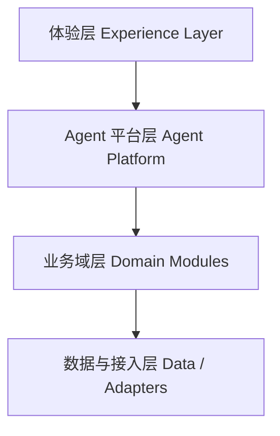

# MirrorMind V2 架构映射与平台选品改造方案

## 1. 结论

`AI_Agent_PRD_MirrorMind_V2.0_认知进化版` 里真正值得迁移到当前 VigilAI 的，不是它的业务场景，而是它的架构思想：

- 用一个统一的 Agent 入口替代多个割裂的 AI 功能入口
- 用会话、轮次、洞察、思考模型这些“过程资产”替代只存最终结果
- 用简化状态机替代多页面、多阶段、强流程化的前端体验
- 复用已有技术基座，但把 AI 能力抽成平台层，而不是继续绑死在当前 `Activity` 业务上

对当前系统来说，这意味着要做的不是“小修小补”，而是一次方向明确的架构升级：

1. 把当前 VigilAI 从“活动机会工作台”升级成“Agent-native intelligence platform”
2. 在这个平台上保留现有“开发者机会”主域
3. 再以独立 bounded context 的方式新增“平台选品”主域

平台选品功能不应该直接塞进现有 `Activity` / `Source` / `Digest` 主链里，而应该挂在新的共享 Agent 平台层之上。

---

## 2. MirrorMind V2 对当前系统最有价值的架构原则

## 2.1 从“多 AI 功能点”变成“统一 Agent 入口”

MirrorMind V2 的核心不是“一个聊天页面”，而是把系统里的 AI 能力统一收口到一个对话引擎里。

当前 VigilAI 的 AI 能力是分散的：

- 机会池里的 AI 精筛
- 模板分析系统
- Agent Analysis 工作流

这三套能力现在各有入口、各有状态、各有输出心智。对用户来说，它们不是一个系统，而是三个相邻功能。

MirrorMind V2 给当前系统的启发是：

- 用户面前应该先是一个统一的 Agent 入口
- 后面再由系统决定走哪条能力链路
- 模板分析、精筛、深度研究都应该成为 Agent 的内部能力，而不是三个平级产品入口

## 2.2 从“最终结果导向”变成“过程资产沉淀”

MirrorMind V2 引入的关键对象不是 memo，而是：

- Session
- Conversation Turn
- Insight
- Thinking Model

当前 VigilAI 主要沉淀的是结果：

- 活动记录
- 分析结果
- 跟进状态
- 日报

但缺少“用户是怎么想清楚的”这一层过程资产。

如果把 MirrorMind 的思路迁进来，当前系统应该增加：

- Agent 会话
- 对话轮次
- 洞察沉淀
- 方法/判断模型

这样系统就不只是存“机会”，还存“围绕机会做过什么思考”。

## 2.3 从“页面流程驱动”变成“状态机驱动”

MirrorMind V2 明确提出要把复杂流程简化成少量状态：

- `ACTIVE`
- `REFLECTING`
- `COMPLETED`
- `ABANDONED`

当前 VigilAI 表面上没有 MirrorMind V1.1 那么重的状态机，但实际上也存在“页面即流程”的问题：

- 列表页看机会
- 模板页调规则
- 结果页看分析
- 详情页定动作
- 跟进页推进
- 日报页沉淀

这套页面结构对熟悉系统的人有效，但对 Agent-native 体验不够友好。

MirrorMind 的启发是：

- 页面保留，但不再是唯一主流程
- 真正的主流程应由 Agent 会话状态驱动
- 页面变成结构化结果面板和回放面板

## 2.4 从“业务耦合 AI”变成“平台层 AI”

MirrorMind V2 强调“复用技术基座、重写 AI 层和交互层”。

这对当前 VigilAI 也成立：

- FastAPI 可以保留
- React/Vite 可以保留
- SQLite 当前阶段可以保留
- OpenAI provider/router 可以保留
- 风控和日志思路可以保留

真正需要改的，是 AI 在系统中的位置：

- 现在 AI 还是挂在业务模块上的附属功能
- 未来 AI 应该先是平台层，再服务各业务域

---

## 3. 当前系统与 MirrorMind V2 的差距

## 3.1 当前系统仍然是 `Activity` 中心，不是 `Session` 中心

当前主对象是 `Activity`。  
MirrorMind V2 的主对象其实是 `Session` 和 `Turn`。

这意味着当前系统更擅长：

- 存储机会
- 浏览机会
- 给机会打分

但不擅长：

- 记录一次完整研究过程
- 记录用户和 Agent 如何形成判断
- 复用一次会话里沉淀出来的洞察

## 3.2 当前 AI 入口分散

现在至少有三种 AI 心智同时存在：

- 自然语言精筛
- 模板规则筛选
- agent-analysis 审核工作流

MirrorMind V2 的做法是把这些差异内化到引擎里，用户只看到统一入口。

## 3.3 当前数据层过重，无法自然承载新主域

`data_manager.py` 已经承担：

- schema 初始化
- CRUD
- 聚合查询
- 分析模板管理
- workspace 聚合
- tracking
- digest
- analysis jobs

如果再直接把“平台选品”继续加进去，会出现两个结果：

1. `data_manager.py` 会进一步失控
2. `Activity` 主域会被电商语义污染

## 3.4 当前前端是多页面工作台，不是统一对话工作台

当前前端结构很适合传统 SaaS，但不适合 Agent-first 产品：

- 页面多
- AI 功能入口分散
- 结果页和交互页分离
- 缺少统一会话容器

MirrorMind V2 给出的方向是：保留结构化页面，但增加一个统一 Agent 工作台作为顶层入口。

---

## 4. 目标架构：把 VigilAI 升级为 Agent Native Platform

## 4.1 目标分层

建议把系统改成 4 层：

### A. 体验层

- 统一 Agent 工作台
- 现有结构化页面
- 平台选品页面

### B. Agent 平台层

- 会话管理
- 对话引擎
- 洞察提炼
- 思考模型/研究模型生成
- 工具调用与路由
- 安全风控
- Artifact 沉淀

### C. 业务域层

- 开发者机会域
- 平台选品域

### D. 数据与接入层

- SQLite / 后续 PostgreSQL
- scrapers
- 淘宝/闲鱼适配器
- AI provider

## 4.2 目标核心原则

### 原则 1：共享 Agent 内核，隔离业务主域

共享的应该是：

- `session`
- `turn`
- `artifact`
- `job`
- `tool routing`
- `safety`

隔离的应该是：

- 开发者机会对象模型
- 平台选品对象模型
- 各自主数据表
- 各自评分逻辑

### 原则 2：统一入口，双模式体验

前台产品保留两种交互模式：

- Agent 模式：统一入口，自然语言发起任务、追问、回放
- Workbench 模式：结构化筛选、列表、详情、跟进

不是用对话替代所有页面，而是让对话成为顶层入口，页面成为结构化结果承载层。

### 原则 3：旧链路不停机迁移

MirrorMind V2 一个非常重要的思路是：

- 保留历史表
- 新流程不再写入旧表
- 分阶段替换

当前 VigilAI 也应这样做：

- 现有 `activities / tracking_items / digests / analysis_jobs` 先保留
- 新平台层增量加表
- 当前页面先不推倒重做
- 新入口先旁路接入

---

## 5. 建议新增的共享平台层

## 5.1 新增共享对象

建议新增一组“平台层对象”，而不是直接在现有 `Activity` 表上补字段。

### `agent_sessions`

- `id`
- `domain_type`：`opportunity | product_selection`
- `entry_mode`：`chat | workbench`
- `status`：`active | reflecting | completed | abandoned`
- `title`
- `user_intent_summary`
- `created_at`
- `updated_at`

### `agent_turns`

- `id`
- `session_id`
- `role`：`user | assistant | tool`
- `content`
- `hidden_analysis`
- `tool_invocations`
- `created_at`

### `agent_artifacts`

- `id`
- `session_id`
- `artifact_type`：`insight | thinking_model | shortlist | action_plan | report`
- `content_json`
- `source_turn_ids`
- `user_confirmed`
- `created_at`

### `agent_jobs_v2`

- `id`
- `session_id`
- `domain_type`
- `job_type`
- `status`
- `input_payload`
- `output_payload`
- `created_at`
- `updated_at`

## 5.2 新增共享服务

建议新增 `app/backend/agent_platform/`：

- `session_service.py`
- `conversation_engine.py`
- `artifact_service.py`
- `tool_router.py`
- `state_machine.py`
- `safety_service.py`
- `repositories.py`

这些模块的职责：

- `session_service`：管理会话生命周期
- `conversation_engine`：统一对话引擎，决定下一轮响应和工具调用
- `artifact_service`：从会话中提炼洞察、短清单、方法模型
- `tool_router`：把不同业务能力挂成可调用工具
- `state_machine`：控制 `active / reflecting / completed / abandoned`
- `safety_service`：复用并扩展现有安全规则

## 5.3 平台层 API

建议新增一组统一接口：

- `POST /api/agent/sessions`
- `GET /api/agent/sessions/{id}`
- `POST /api/agent/sessions/{id}/turns`
- `GET /api/agent/sessions/{id}/turns`
- `GET /api/agent/sessions/{id}/artifacts`
- `POST /api/agent/sessions/{id}/complete`

这组接口的作用不是替代现有 API，而是成为顶层 Agent 交互入口。

---

## 6. 对当前开发者机会系统的改造方式

## 6.1 保留不动的部分

当前可以直接保留的部分：

- `scrapers/*`
- `scheduler.py`
- `config.py` 中的来源配置
- `/api/activities*`
- `/api/tracking*`
- `/api/digests*`
- 当前 `/workspace`、`/activities`、`/tracking` 等页面

原因：

- 这些是当前最稳定的业务基座
- 先让平台层旁路接入，风险最低

## 6.2 需要抽离的平台能力

当前最需要从业务里抽出来的能力：

### 1. AI provider/router

现有 `analysis/providers/*` 可以提升为平台共享层。

### 2. agent-analysis orchestration

现有 `run_manager.py` 的 job 编排能力可以作为平台层 `job orchestration` 的第一版基础。

### 3. 安全风控

现有 `safety_gate.py` 和风险拦截逻辑可以提升为平台统一安全层。

### 4. 结果沉淀能力

当前只有 `digest`，未来应该有更通用的 `artifact` 概念。

## 6.3 对开发者机会域的具体改造

建议把“开发者机会”域拆成：

- `opportunity_domain/`
  - `models.py`
  - `repository.py`
  - `service.py`
  - `scoring.py`
  - `tracking_service.py`
  - `digest_service.py`

这样 Agent 平台调用的不是 `data_manager`，而是某个 domain service。

## 6.4 前端改造方向

新增一个统一页面：

- `/agent`

它承担两个作用：

1. 作为统一 AI 入口
2. 作为跨域能力的顶层工作台

在这个页面里，用户可以：

- 直接问“最近有哪些 solo-friendly grant 值得看”
- 让 Agent 推荐活动
- 让 Agent 解释某条活动为什么值得跟进
- 让 Agent 帮忙形成下一步动作

现有 `/activities` 等页面继续保留，作为结构化浏览和执行页。

---

## 7. 如何在新架构里新增平台选品功能

## 7.1 平台选品不应当复用当前主域表

这一点维持原结论不变：

- 不复用 `Activity`
- 不复用 `Category`
- 不复用 `Source`
- 不复用 `Digest`

但它应该复用“共享 Agent 平台层”。

## 7.2 平台选品应该成为第二个业务域

建议新增：

- `app/backend/product_selection/`
- `app/frontend/src/pages/selection/`

后端独立表：

- `selection_queries`
- `selection_opportunities`
- `selection_opportunity_signals`
- `selection_tracking_items`

前端独立页面：

- `/selection/workspace`
- `/selection/opportunities`
- `/selection/opportunities/:id`
- `/selection/compare`
- `/selection/tracking`

## 7.3 平台选品如何接入 Agent 平台

关键不是“单独做一套聊天功能”，而是把平台选品能力注册成 Agent 工具。

建议增加一个 `domain tool adapter` 概念：

- `OpportunitySearchTool`
- `OpportunityExplainTool`
- `SelectionQueryTool`
- `SelectionCompareTool`
- `SelectionExplainTool`

Agent 会根据 `session.domain_type` 和当前用户意图自动选择调用。

例如：

用户说：

- “最近有哪些 grant 值得跟进？”  
  -> 调开发者机会域工具

- “淘宝上宠物智能饮水机这个方向还能做吗？”  
  -> 调平台选品域工具

这样两个业务域共享一套 Agent 入口，但各自保留独立对象模型和领域逻辑。

## 7.4 平台选品的交互模式

平台选品建议同时支持两种模式：

### A. 结构化工作台模式

沿用你已经整理过的 MVP：

- 关键词/链接输入
- 机会池
- 详情
- 收藏
- 对比
- 跟进

### B. Agent 对话模式

新增更强的 Agent 入口：

- 用户输入自然语言问题
- Agent 先追问必要上下文
- 再调用 `SelectionQueryTool`
- 生成 shortlist / insight / action_plan artifact
- 用户进入结构化页面继续看详情和跟进

这就是 MirrorMind 架构思想在平台选品上的真正价值：

- 不是“给选品功能加个聊天框”
- 而是“让选品域从第一天起就是 Agent-native”

## 7.5 平台选品的长期演进

如果平台层先搭好，平台选品后续演进会更顺：

- V1：查询驱动的机会池
- V1.1：Agent 追问式选品会话
- V1.2：监控与报告写成 artifact
- V2：跨会话沉淀“选品偏好画像”

这和 MirrorMind 的“跨会话认知档案”在架构上是同一个方向，只是业务含义不同。

---

## 8. 建议的改造顺序

## Phase 1：先搭共享 Agent 平台层

目标：

- 不动现有业务主链
- 新增 `session / turn / artifact / agent job v2`
- 提供统一 `/api/agent/*` 入口

完成标志：

- 能在当前系统中跑一个最小 Agent 会话
- 能保存 turn 和 artifact

## Phase 2：让开发者机会域接入共享平台

目标：

- 把当前机会域能力注册成 Agent 工具
- 新增 `/agent` 页面
- 用户能通过对话检索、解释和跟进机会

完成标志：

- Agent 入口可调用当前机会池和详情能力

## Phase 3：拆出平台选品 bounded context

目标：

- 新建 `product_selection` 后端域
- 新建 `/selection/*` 前端页面
- 接入淘宝/闲鱼最小适配器

完成标志：

- 结构化选品 MVP 跑通

## Phase 4：把平台选品挂入 Agent 平台

目标：

- 增加 `SelectionQueryTool / SelectionExplainTool / SelectionCompareTool`
- 让 `/agent` 可以直接发起选品研究会话

完成标志：

- 一个 Agent 入口可以路由到两个业务域

## Phase 5：再考虑监控、报告和跨会话画像

这部分先不要在首轮改造里做重。

原因：

- 当前最缺的是平台层
- 不是更多页面
- 也不是更多表

---

## 9. 最终建议

对当前 VigilAI，MirrorMind V2 最值得借的不是“认知教练”业务，而是下面 4 个架构方向：

1. 统一 Agent 入口
2. Session/Turn/Artifact 为中心的数据结构
3. 简化状态机和对话驱动主流程
4. 保留旧链路、增量迁移

在这个方向下，平台选品功能的正确接法也就很明确了：

- 不直接改当前 `Activity` 主域
- 先搭共享 Agent 平台层
- 再把平台选品作为第二个独立业务域挂上去

这样改完之后，VigilAI 不再只是“开发者机会工具”，而会变成一个可扩展的 Agent Intelligence Platform。  
开发者机会是第一个垂域，平台选品是第二个垂域，后面如果还要加别的研究型场景，也不需要再重来一遍。
