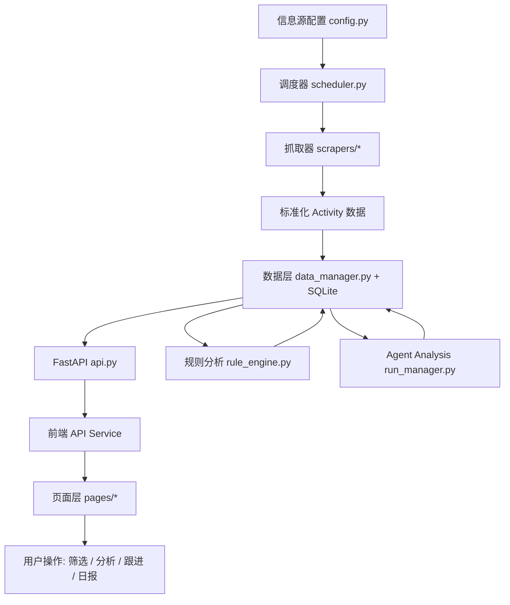
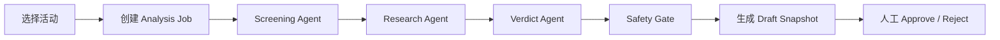
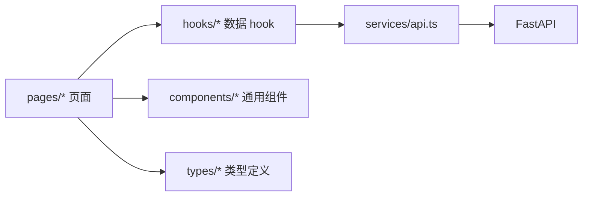
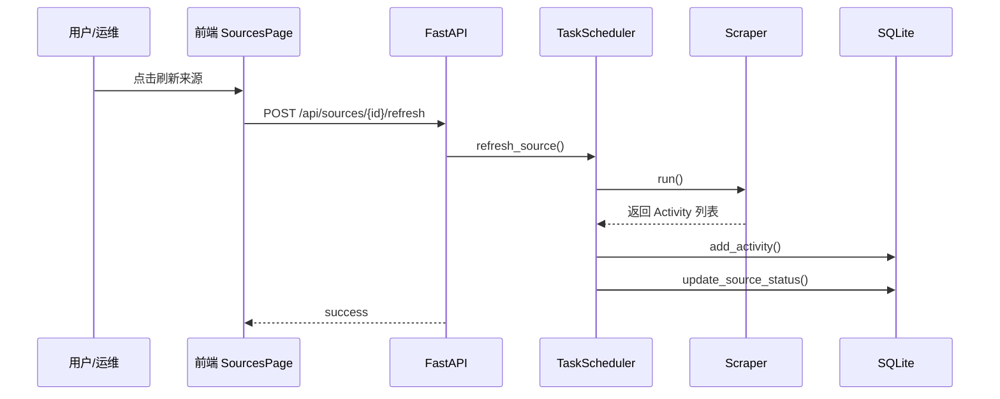

# 当前系统架构与技术实现说明

## 1. 文档目标

这份文档从工程实现角度整理当前 VigilAI 系统，统一回答 3 个问题：

1. 当前系统的整体架构是怎么分层的
2. 当前系统的技术方案是如何落地的
3. 当前系统的主要功能逻辑是如何串起来的

这份文档以当前仓库代码为准，不以历史 PRD 或理想态为准。

相关补充文档：

- [当前项目核心功能梳理](./当前项目核心功能梳理.md)
- [当前业务逻辑与产品分析](./当前业务逻辑与产品分析.md)

---

## 2. 系统一句话定义

VigilAI 当前是一个面向开发者机会发现、AI 判断、人工跟进和日报沉淀的情报工作台。

它的本质不是单纯的信息抓取器，而是一个围绕 `机会采集 -> 机会筛选 -> AI 分析 -> 动作推进 -> 日报沉淀 -> 来源治理` 展开的轻量工作流系统。

---

## 3. 系统整体架构

### 3.1 总体分层



### 3.2 当前运行口径

系统设计上具备“调度器 + 抓取器 + 分析器 + 前端工作台”四层，但当前真实运行方式有一个重要前提：

- 调度器代码存在
- 启动时默认禁用了自动调度
- 当前主要依赖前端手动触发来源刷新

因此，当前系统更准确的运行口径是：

`手动刷新驱动的数据采集系统 + 持久化机会池 + 双分析链路 + 人工跟进工作台`

---

## 4. 技术栈与运行方式

### 4.1 后端技术栈

- Python
- FastAPI
- Uvicorn
- Pydantic
- APScheduler
- SQLite
- httpx
- feedparser
- BeautifulSoup4 / lxml
- Firecrawl
- OpenAI Python SDK
- pytest / pytest-asyncio

### 4.2 前端技术栈

- React 18
- TypeScript
- Vite
- React Router
- Tailwind CSS
- Vitest
- Testing Library

### 4.3 当前工程实现特征

- 后端是单体 FastAPI 应用，没有拆成多服务
- 存储层采用 SQLite，本地文件数据库，适合单机运行和快速迭代
- 前端没有引入 Redux、Zustand、TanStack Query 这类全局状态或服务端状态框架
- 前端主要采用 `页面组件 + 自定义 hooks + API service + 本地 state` 模式
- AI 分析能力分成两条链路：
  - 规则/模板驱动分析
  - job 驱动的 agent-analysis 工作流

### 4.4 启动方式

后端：

```bash
cd app/backend
pip install -r requirements.txt
python main.py
```

前端：

```bash
cd app/frontend
npm install
npm run dev
```

---

## 5. 代码结构与职责划分

```text
app/
  backend/
    main.py                  # 应用启动入口
    api.py                   # FastAPI 路由层
    config.py                # 环境变量与信息源配置
    models.py                # 核心数据模型
    data_manager.py          # SQLite 数据访问与聚合逻辑
    scheduler.py             # 调度器与抓取任务管理
    scrapers/                # 各类来源抓取器
    analysis/                # 规则分析与 agent-analysis
    tests/                   # 后端测试
  frontend/
    src/
      App.tsx               # 前端路由入口
      components/           # 通用组件
      hooks/                # 数据获取和状态管理 hooks
      pages/                # 页面级模块
      services/             # API 调用层
      types/                # 前端类型定义
docs/
  当前项目核心功能梳理.md
  当前业务逻辑与产品分析.md
```

---

## 6. 后端架构说明

### 6.1 启动层：`main.py`

`main.py` 负责系统启动和依赖注入，主要做 4 件事：

1. 初始化日志系统
2. 创建 `DataManager`
3. 创建 `TaskScheduler`
4. 把 `data_manager` 和 `scheduler` 注入 `app.state`

当前启动行为里最关键的实现细节：

- 调度器对象会被初始化
- 但 `self.scheduler.start()` 被显式注释掉
- 因此不会自动注册并执行周期任务

这也是当前系统“支持调度设计，但默认手动刷新”的根本原因。

### 6.2 API 层：`api.py`

`api.py` 是统一 API 网关，负责：

- 路由定义
- 请求参数校验
- HTTP 错误转换
- 序列化输出
- 基础中间件日志记录

当前接口可以分成 8 组：

### 机会池与详情

- `GET /api/activities`
- `GET /api/activities/{activity_id}`
- `POST /api/activities/ai-filter`

### 来源治理

- `GET /api/sources`
- `POST /api/sources/{source_id}/refresh`
- `POST /api/sources/refresh-all`

### 工作台与统计

- `GET /api/workspace`
- `GET /api/stats`
- `GET /api/categories`
- `GET /api/health`

### 模板分析

- `GET /api/analysis/templates`
- `GET /api/analysis/templates/default`
- `POST /api/analysis/templates`
- `PATCH /api/analysis/templates/{template_id}`
- `DELETE /api/analysis/templates/{template_id}`
- `POST /api/analysis/templates/{template_id}/duplicate`
- `POST /api/analysis/templates/{template_id}/activate`
- `GET /api/analysis/templates/{template_id}/preview`
- `POST /api/analysis/templates/preview`
- `POST /api/analysis/templates/preview/results`
- `POST /api/analysis/run`
- `GET /api/analysis/results`
- `GET /api/analysis/results/{activity_id}`

### Agent Analysis

- `POST /api/agent-analysis/jobs`
- `GET /api/agent-analysis/jobs`
- `GET /api/agent-analysis/jobs/{job_id}`
- `GET /api/agent-analysis/items/{item_id}`
- `POST /api/agent-analysis/items/{item_id}/approve`
- `POST /api/agent-analysis/items/{item_id}/reject`

### 跟进系统

- `GET /api/tracking`
- `POST /api/tracking/{activity_id}`
- `PATCH /api/tracking/{activity_id}`
- `DELETE /api/tracking/{activity_id}`

### 日报系统

- `GET /api/digests`
- `GET /api/digests/candidates`
- `POST /api/digests/candidates/{activity_id}`
- `DELETE /api/digests/candidates/{activity_id}`
- `GET /api/digests/{digest_id}`
- `POST /api/digests/generate`
- `POST /api/digests/{digest_id}/send`

### 6.3 数据层：`data_manager.py`

`data_manager.py` 是当前后端最核心的基础设施层，承担了 3 类职责：

1. SQLite 表初始化与 schema 兼容升级
2. 各类读写操作和聚合查询
3. 工作台、分析结果、日报等业务视图的拼装

当前它既是 repository，也承担了 service 的一部分职责，因此是一个典型的“单体数据中枢”。

### 6.4 数据模型：`models.py`

核心模型包括：

- `Activity`
- `Source`
- `TrackingState`
- `DigestRecord`
- `AnalysisJob`
- `AnalysisJobItem`
- `AnalysisStep`
- `AnalysisEvidence`
- `AnalysisReview`

其中 `Activity` 是全系统主对象，承载：

- 原始机会字段
- 抓取后的展示字段
- 分析状态
- AI 结构化字段
- 跟进和日报关联状态

### 6.5 调度与抓取：`scheduler.py` + `scrapers/*`

调度器层负责：

- 根据 `config.py` 中的 `SOURCES_CONFIG` 注册来源
- 为不同来源类型分配 scraper
- 维护 scraper 状态
- 管理失败重试、连续失败暂停、冷却恢复

当前抓取器体系支持多种类型：

- `rss`
- `web`
- `api`
- `firecrawl`
- `kaggle`
- `tech_media`
- `airdrop`
- `data_competition`
- `hackathon_aggregator`
- `bounty`
- `enterprise`
- `government`
- `design_competition`
- `coding_competition`
- `universal`

当前实现特点：

- 来源配置集中在 `config.py`
- 抓取器类型通过映射动态分配
- 抓取成功后写入 `activities`
- 抓取失败会更新来源状态并累计失败次数

### 6.6 AI 分析体系：`analysis/*`

当前 AI 分析不是一套，而是两套并存。

### A. 规则/模板分析链路

相关模块：

- `analysis/rule_engine.py`
- `analysis/template_defaults.py`
- `analysis/template_compiler.py`
- `data_manager.py` 中的模板 CRUD 与重新分析逻辑

特点：

- 模板由多层 `layer + conditions` 组成
- 支持 `hard_gate / roi / trust / priority` 等层
- 输出 `passed / watch / rejected`
- 适合做稳定、低成本、可解释的第一轮筛选

### B. Agent Analysis 工作流

相关模块：

- `analysis/run_manager.py`
- `analysis/screening_agent.py`
- `analysis/research_agent.py`
- `analysis/verdict_agent.py`
- `analysis/safety_gate.py`
- `analysis/review_service.py`

流程：



特点：

- 面向单条或批量机会运行
- 每条 item 会记录步骤、证据、模型信息和最终草稿
- 支持人工审核通过或驳回
- 更像“AI 辅助研究工作流”，而不只是打分器

---

## 7. 前端架构说明

### 7.1 前端路由层

前端入口在 `app/frontend/src/App.tsx`，当前页面路由包括：

- `/workspace`
- `/activities`
- `/activities/:id`
- `/analysis/results`
- `/analysis/templates`
- `/tracking`
- `/digests`
- `/sources`
- `/dashboard`

这说明当前前端已经不是单页列表，而是一个多模块工作台。

### 7.2 前端分层方式

当前前端主要采用下面的结构：



具体分层职责：

- `pages/*`：页面级组合和交互编排
- `hooks/*`：封装请求、loading、error、refetch
- `services/api.ts`：统一 HTTP 请求
- `types/*`：前端对象类型定义
- `components/*`：可复用 UI 组件

### 7.3 当前前端状态管理方式

当前没有单独的全局状态管理层。

主要特征：

- 页面内 `useState` 管理界面交互状态
- `hooks` 内管理请求状态
- 通过 `api.ts` 发起请求
- 通过 props 和路由传递页面上下文

这种方式的优点是简单直接，适合当前规模；缺点是当页面状态和交互继续膨胀时，局部状态会越来越重。

### 7.4 当前前端核心组件类型

### 通用布局组件

- `Layout.tsx`
- `Header.tsx`
- `Footer.tsx`
- `ErrorBoundary.tsx`
- `Toast.tsx`

### 机会池组件

- `ActivityCard.tsx`
- `FilterBar.tsx`
- `SearchBox.tsx`
- `SortSelect.tsx`
- `Pagination.tsx`
- `OpportunityAiFilterPanel.tsx`

### Agent Analysis 组件

- `AgentVerdictCard.tsx`
- `EvidencePanel.tsx`
- `ExecutionTracePanel.tsx`
- `ReviewActionBar.tsx`
- `JobStatusBanner.tsx`
- `DraftBatchToolbar.tsx`

---

## 8. 核心数据模型与数据表

### 8.1 主数据对象

### `Activity`

系统统一机会对象，负责承载：

- 标题、描述、链接、来源、分类
- 奖励、时间、地点、主办方
- 展示辅助字段，如 `image_url`、`summary`
- 排序辅助字段，如 `score`、`trust_level`
- 分析字段，如 `analysis_status`、`analysis_reasons`
- 关联状态，如 `is_tracking`、`is_favorited`、`is_digest_candidate`

### `Source`

来源对象，负责描述：

- 来源名称和类型
- 刷新优先级和更新频率
- 上次运行、上次成功、状态、错误信息

### `TrackingState`

跟进对象，负责描述：

- 收藏状态
- 跟进状态
- 备注
- 下一步动作
- 提醒时间

### `DigestRecord`

日报对象，负责描述：

- 日报日期
- 标题、摘要、正文
- 收录机会列表
- 发送状态

### 8.2 SQLite 核心表

当前数据库核心表包括：

- `activities`
- `sources`
- `tracking_items`
- `digests`
- `digest_candidates`
- `analysis_templates`
- `analysis_jobs`
- `analysis_job_items`
- `analysis_item_steps`
- `analysis_evidence`
- `analysis_reviews`

### 表职责说明

| 表名 | 作用 |
| --- | --- |
| `activities` | 存储主机会对象和分析结果快照 |
| `sources` | 存储信息源状态 |
| `tracking_items` | 存储收藏、跟进、备注和提醒 |
| `digests` | 存储日报成品 |
| `digest_candidates` | 存储日报候选池 |
| `analysis_templates` | 存储规则分析模板 |
| `analysis_jobs` | 存储 agent-analysis 任务 |
| `analysis_job_items` | 存储任务中的单条机会执行记录 |
| `analysis_item_steps` | 存储 screening / research / verdict / safety 等步骤轨迹 |
| `analysis_evidence` | 存储研究证据 |
| `analysis_reviews` | 存储人工审核记录 |

### 8.3 当前数据持久化策略

- 所有业务数据统一落 SQLite
- schema 演进通过 `data_manager.py` 里的 `_ensure_columns` 做兼容补列
- 没有独立 migration 框架
- 适合当前单体演进，但长期会增加 schema 管理成本

---

## 9. 核心功能逻辑

### 9.1 机会采集逻辑



关键规则：

- 来源按配置类型分配 scraper
- 每条机会按 `source_id + url` 去重
- 刷新结果同时更新来源健康状态

### 9.2 机会池逻辑

用户进入 `/activities` 后，前端通过 `useActivities` 调用 `GET /api/activities`。

后端能力包括：

- 分类筛选
- 来源筛选
- 状态筛选
- 搜索
- 跟进/收藏筛选
- 排序
- 分页

机会池当前是整个系统的主入口，同时承载：

- 浏览
- 初筛
- 批量操作
- AI 精筛入口

### 9.3 AI 精筛逻辑

AI 精筛不是直接全库检索，而是“先基于普通筛选缩小候选，再做自然语言精筛”。

流程：

1. 用户先在机会池设置基础筛选
2. 前端调用 `POST /api/activities/ai-filter`
3. 后端先拉取候选集合
4. 如果候选数超限则拒绝执行
5. 进入 `opportunity_ai_filter` 做 AI 语义筛选
6. 返回匹配原因和置信描述

这个设计的核心目的是控制 AI 成本，并避免把自然语言筛选直接变成全库搜索。

### 9.4 模板分析逻辑

模板分析用于给每条机会做规则化判断。

主流程：

1. 用户在模板中心创建或编辑模板
2. 模板按 `layers + conditions` 组织
3. 用户可预览模板在当前样本集上的通过/观察/拒绝结果
4. 用户激活默认模板或触发重新分析
5. 分析结果写回 `activities` 表的分析字段

模板分析的价值是：

- 把“偏好”转成结构化规则
- 把“值得看/不值得看”转成可解释状态
- 让机会池和分析结果页共享同一套判断口径

### 9.5 Agent Analysis 工作流逻辑

这是当前系统里更重的一条 AI 工作流。

主流程：

1. 从详情页或批量场景发起 job
2. 创建 `analysis_jobs`
3. 为每条 activity 创建 `analysis_job_items`
4. 执行 screening
5. 根据策略执行 research
6. 执行 verdict
7. 经过 safety gate
8. 生成 draft snapshot
9. 人工 approve 或 reject
10. 审核结果写回业务对象

这条链路的本质是：

- 模板分析更像批量规则判断
- agent-analysis 更像半自动研究和审核流水线

### 9.6 跟进逻辑

跟进系统是从“看机会”到“推进机会”的桥梁。

主流程：

1. 用户在列表页或详情页收藏/加入跟进
2. 前端调用 `POST/PATCH /api/tracking/{activity_id}`
3. 后端 upsert `tracking_items`
4. 工作台和跟进页读取状态变化

支持的状态：

- `saved`
- `tracking`
- `done`
- `archived`

支持的动作：

- 收藏
- 写备注
- 写下一步动作
- 设置提醒时间

### 9.7 日报逻辑

日报系统把高价值机会沉淀成输出内容。

主流程：

1. 用户将机会加入日报候选池
2. 候选数据写入 `digest_candidates`
3. 用户触发生成日报
4. 系统按候选池或最近高分机会生成 `digests`
5. 用户可查看、复制、标记已发送

日报系统的定位不是 BI 报表，而是把判断结果转成日常摘要。

### 9.8 工作台逻辑

工作台是聚合视图，不是独立数据源。

`GET /api/workspace` 会聚合多块数据：

- `overview`
- `top_opportunities`
- `first_actions`
- `analysis_overview`
- `alert_sources`
- `digest_preview`
- `blocked_opportunities`
- `trends`

工作台负责的是“排优先级”，不是“替代列表页”。

---

## 10. 当前系统特征与限制

### 10.1 架构特征

- 单体后端，单库持久化，易于理解和快速修改
- 前端分层清晰，但仍以页面本地状态为主
- 数据模型以 `Activity` 为中心，功能都围绕主对象展开
- 工作流已经形成闭环，不再只是抓取展示

### 10.2 当前实现限制

### 1. 自动调度默认未启用

虽然系统有完整 `TaskScheduler`，但启动时禁用了自动调度，当前主要依赖手动刷新。

### 2. `data_manager.py` 过重

当前数据层已经同时承担：

- schema 初始化
- CRUD
- 聚合查询
- 分析模板管理
- 工作台拼装
- 日报逻辑

后续如果继续增加业务域，这个文件会成为明显瓶颈。

### 3. 规则分析与 agent-analysis 并存

这是能力增强，也是复杂度来源。

当前系统里已经存在两套分析口径：

- 规则模板筛选
- agent 工作流审核

如果后续没有统一治理，会出现理解成本和维护成本上升。

### 4. 来源配置集中但体量大

所有信息源集中在 `config.py`，管理简单，但来源数量持续增加后：

- 配置维护成本会升高
- 分类漂移更容易发生
- 单文件可读性会下降

### 5. 当前仍以工程去重为主

现在主要以 `source_id + url` 做唯一约束，尚未形成跨来源的产品级归并能力。

---

## 11. 结论

当前 VigilAI 的工程形态可以概括为：

一个以 `Activity` 为核心对象、以 SQLite 为单库持久化、以 FastAPI 为单体后端、以前端页面工作台为操作入口，并同时具备规则分析与 agent-analysis 两条判断链路的机会决策系统。

它当前最稳的不是“自动监控平台”，而是下面这条链：

`来源刷新 -> 机会入库 -> 机会池筛选 -> AI 判断 -> 跟进动作 -> 日报沉淀`

如果后续继续演进，这份文档可以作为当前系统实现边界的基线说明。
