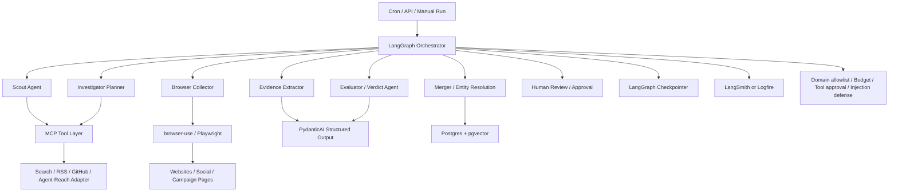

# VigilAI Agent 系统整合落地正式方案

更新时间：2026-05-15

## 0. 调研依据

本方案基于 `docs/AI Agent前沿技术调研与架构建议.md` 的技术路线，并已将官方文档快照保存到本地：

- 官方文档索引：`docs/agent-system-research/official-docs-index.md`
- 官方文档快照目录：`docs/agent-system-research/official-docs/`
- 共保存官方文档快照：54 份

核心本地依据：

- LangGraph：`official-docs/p0-langgraph-overview.md`、`p0-langgraph-durable-execution.md`、`p0-langgraph-persistence.md`、`p0-langgraph-interrupts.md`
- PydanticAI：`official-docs/p0-pydanticai-overview.md`、`p0-pydanticai-output.md`、`p0-pydanticai-mcp.md`、`p0-pydanticai-durable-execution.md`
- MCP：`official-docs/p1-mcp-architecture.md`、`p1-mcp-server-concepts.md`、`p1-mcp-security-best-practices.md`
- browser-use：`official-docs/p2-browser-use-quickstart.md`、`p2-browser-use-custom-functions.md`、`p2-browser-use-sessions.md`
- Eval / Trace：`official-docs/p3-langsmith-tracing-quickstart.md`、`p3-langsmith-evaluation.md`、`p3-pydantic-evals.md`
- A2A：`official-docs/p4-a2a-docs.md`、`p4-a2a-specification.md`、`p4-a2a-agent-discovery.md`
- 安全治理：`official-docs/security-owasp-llm-top10.md`、`security-owasp-agentic-ai.md`、`security-owasp-mcp-top10.md`、`security-openai-resist-prompt-injection.md`

## 1. 总体结论

VigilAI 不应寻找一个“全包式 Agent 框架”来替代所有模块。更合理的生产方案是组合式：

```text
LangGraph 编排层
+ PydanticAI 单 Agent / 结构化输出层
+ MCP 工具协议层
+ browser-use 浏览器执行层
+ Postgres/pgvector 状态与证据层
+ LangSmith 或 Logfire 观测评测层
+ 自建 Guardrails / HITL / 权限治理层
+ A2A 后置互通层
```

核心原因：

- LangGraph 的优势在 durable execution、checkpoint、interrupt、human-in-the-loop 和长流程编排，不适合替代所有业务 agent 逻辑。
- PydanticAI 的优势在结构化输出、类型校验、工具调用、MCP/A2A 接入和 eval，适合实现每个 specialist agent。
- MCP 解决 agent-to-tool 标准化，不解决流程编排。
- browser-use 解决真实网页交互，不解决业务判断。
- LangSmith/Logfire 解决 trace/eval/cost，不应在 P0 阶段阻塞核心闭环。
- A2A 解决 agent-to-agent 互通，应在内部 agent 稳定后再开放。

## 2. 目标架构



## 3. 模块职责

### 3.1 LangGraph Orchestrator

职责：

- 管理奖励活动发现的状态机。
- 将现有 `run_investigation_cycle` 拆成显式 graph nodes。
- 管理 checkpoint、resume、interrupt、retry。
- 控制最大轮数、最大 URL、最大 token/cost、超时。
- 将人工审核插入到高风险节点。

建议节点：

```text
seed_sources
discover_candidates
collect_initial_documents
extract_evidence
evaluate_candidate_baseline
plan_next_investigation
collect_follow_up_documents
evaluate_candidate_llm
merge_opportunity
human_review_if_needed
finish
```

实现原则：

- 每个有外部副作用的节点必须具备 idempotency key。
- 浏览器抓取、搜索、写库、LLM 调用都要作为可追踪 task。
- checkpoint 使用 `thread_id = investigation_run_id`。
- P0 可以先用内存或 SQLite checkpointer；进入生产后切到 Postgres checkpointer。

### 3.2 PydanticAI Specialist Agents

使用 PydanticAI 实现以下 specialist：

- `EvidenceExtractorAgent`
- `InvestigatorPlannerAgent`
- `RewardEvaluatorAgent`
- `RiskReviewAgent`
- `SourceQualityAgent`

PydanticAI 的主要用途：

- 严格结构化输出。
- Pydantic schema 校验。
- LLM 输出失败后的 self-correction。
- 工具依赖注入。
- 对 evaluator 建 eval case。

P0 只新增 `RewardEvaluatorAgent`，保留现有规则 evaluator 作为 baseline。后续逐步迁移 extractor 和 planner。

### 3.3 MCP Tool Layer

MCP 层负责把工具统一成标准接口，不直接承载复杂业务逻辑。

第一批 MCP tools：

- `search_web(query, domains?, max_results?)`
- `search_github(query, max_results?)`
- `read_rss(feed_url, limit?)`
- `agent_reach_search(platform, query, limit?)`
- `browser_collect(url, objective, constraints?)`
- `fetch_page_markdown(url)`
- `lookup_source_health(source_id)`
- `store_raw_document(payload)`

工具实现建议：

- 先做本地 stdio MCP server。
- 每个 tool 都返回结构化 JSON。
- 工具层只做 IO 和轻度标准化，不做最终业务判断。
- 对外部网页和社交平台工具做 domain allowlist / denylist。

### 3.4 Browser Collector

browser-use 用于 P2 替代“只抓页面”的弱抓取逻辑。

目标能力：

- 打开活动页。
- 点击 FAQ / Rules / Terms / Reward / Referral。
- 站内搜索活动关键词。
- 展开折叠内容。
- 翻页收集候选活动。
- 保存最终 URL、页面文本、关键 DOM、截图、动作轨迹。

边界：

- P2 阶段以只读调查为主。
- 不提交表单，不注册账号，不领取奖励。
- 登录态和 cookies 单独隔离。
- 对任何写操作使用 HITL approval。

### 3.5 Evidence Store

建议 Postgres 中补齐以下核心表或等价结构：

- `agent_runs`
- `agent_steps`
- `tool_calls`
- `source_candidates`
- `raw_documents`
- `evidence_items`
- `opportunity_evaluations`
- `opportunity_merges`
- `eval_cases`
- `eval_results`

关键字段：

- `run_id`
- `thread_id`
- `source_url`
- `canonical_url`
- `tool_name`
- `tool_input`
- `tool_output_ref`
- `evidence_type`
- `evidence_text`
- `evidence_url`
- `confidence`
- `model_name`
- `prompt_version`
- `cost_estimate`
- `latency_ms`
- `failure_type`

### 3.6 Evaluator

保留两层 evaluator：

1. Baseline evaluator
   - 使用当前规则逻辑。
   - 快、便宜、可解释。
   - 作为回归基线和兜底。

2. LLM evaluator
   - 使用 PydanticAI。
   - 必须基于 evidence id 输出结论。
   - 不允许只凭页面摘要判断。
   - 输出统一 schema。

建议 schema：

```text
is_target_opportunity: bool
opportunity_type: invite_reward | registration_reward | task_reward | bounty | airdrop | unknown
reward_type: cash | coupon | points | token | physical | unknown
stage_label: high_value | followable | needs_more_evidence | low_value | reject
confidence: float
evidence_sufficiency: strong | good | partial | weak | insufficient
missing_evidence: list
risk_flags: list
required_next_actions: list
quoted_evidence_ids: list
reasoning_brief: string
```

## 4. P0-P4 落地路径

### P0：先搭骨架

目标：

- 把现有 `run_investigation_cycle` 迁到 LangGraph。
- 保留规则 evaluator。
- 新增 PydanticAI evaluator。
- 让一次 investigation run 有稳定的状态、节点和结果。

交付物：

- `RewardInvestigationGraph`
- `RewardGraphState`
- `BaselineEvaluatorNode`
- `PydanticEvaluatorNode`
- graph-level run record
- 最小 checkpoint
- 单元测试和 10 条 fixture case

验收标准：

- 现有 reward opportunity 流程行为不倒退。
- 同一个 candidate 可重复执行并得到稳定结构化结果。
- LLM evaluator 失败时自动回退 baseline evaluator。
- 每个 step 有本地持久化记录。

### P1：补真实工具层

目标：

- 把搜索、RSS、GitHub、browser-use、agent-reach 包装成 MCP tools。
- 让 Scout 和 Investigator 通过 MCP 调用工具。

交付物：

- `vigilai-mcp-tools` 本地 server
- `search_web`
- `search_github`
- `read_rss`
- `agent_reach_search`
- `fetch_page_markdown`
- 工具调用审计记录

验收标准：

- 不直接在业务节点里写外部 IO。
- 工具调用输入输出全结构化。
- 工具失败有明确 failure_type。
- 当前 agent-reach 不可用时能降级到 GitHub/Jina/RSS 或其他搜索工具。

### P2：补强浏览器调查

目标：

- 用 browser-use 实现真实网页调查能力。
- 支持点击、站内搜索、FAQ/规则页追踪。

交付物：

- `browser_collect` MCP tool
- 浏览器 session 配置
- 只读操作策略
- screenshot/artifact 保存
- dynamic page fixture tests

验收标准：

- 能处理动态渲染页面。
- 能打开 FAQ/规则/Terms 页面并提取证据。
- 能保存动作轨迹和截图。
- 不执行未经批准的写操作。

### P3：补 eval 和 trace

目标：

- 接 LangSmith 或 Logfire。
- 建立 50-100 条奖励活动样本集。
- 量化召回率、误判率、证据完整率。

建议选择：

- 如果主编排使用 LangGraph，优先 LangSmith。
- 如果 PydanticAI 成为主体且希望 OpenTelemetry 兼容，选择 Logfire。
- 第一阶段不要两套都上，避免观测系统重复。

指标：

- recall rate
- precision
- evidence completeness
- duplicate merge accuracy
- expired opportunity detection
- tool failure rate
- browser success rate
- cost per accepted opportunity
- latency per investigation

验收标准：

- 每个 graph run 可追踪。
- 每次 evaluator 变更能跑 eval set。
- 有 failure taxonomy。
- 能比较 baseline evaluator 和 LLM evaluator。

### P4：再考虑 A2A

目标：

- 内部 agent 稳定后，把 Scout 或 Browser Agent 暴露成 A2A agent。
- 支持未来接入外部 agent 网络。

首批 A2A agent：

- `RewardScoutAgent`
- `RewardBrowserInvestigatorAgent`
- `RewardVerdictAgent`

验收标准：

- 每个 agent 有 Agent Card。
- 只暴露稳定、可审计、权限受控的能力。
- A2A 不绕过 MCP 工具权限和本地治理层。

## 5. 安全治理方案

必须先实现的控制：

- Domain allowlist / denylist。
- Tool approval policy。
- Token / cost / time budget cap。
- Read-only browser mode。
- 登录态隔离。
- Prompt injection sanitizer。
- Web content 与 system instruction 严格隔离。
- 高风险动作人工确认。
- 工具输出标记来源和可信等级。

关键原则：

- 网页内容永远不进入 system prompt。
- 网页中的指令一律视为非可信数据。
- 工具调用必须由 orchestrator 审批，不由网页内容直接触发。
- 所有外部 IO 都必须留 trace。

## 6. 和当前代码的迁移关系

当前模块保留策略：

- `scout.py`：保留为 Scout baseline，后续接 MCP search。
- `crawl4ai_collector.py`：保留为 cheap/static collector，P2 后作为 browser-use 的兜底。
- `recall.py`：保留为快速召回 baseline。
- `evaluator.py`：保留为 baseline evaluator。
- `investigator.py`：P0 保留，P1/P2 逐步替换为 PydanticAI planner。
- `agent_loop.py`：迁移为 LangGraph。
- `merger.py`：保留并增强 entity resolution。
- `repository.py`：继续作为持久化边界，补 agent run / step / tool call 表。

迁移策略：

1. 不一次性推翻当前实现。
2. 先用 LangGraph 包住当前节点。
3. 再逐个替换节点内部实现。
4. 每替换一个节点，都用 eval set 对比 baseline。

## 7. 技术选型最终建议

推荐主线：

```text
LangGraph
+ PydanticAI
+ MCP
+ browser-use
+ Postgres / pgvector
+ LangSmith
+ 自建治理层
+ A2A 后置
```

不推荐：

- 全部用 CrewAI 重写。
- 全部用 AutoGen 重写。
- 直接把 browser-use 当业务 agent 主框架。
- 在没有 eval set 前大量调 prompt。
- 在工具权限未治理前接入登录态浏览器。

备选：

- 如果后续决定降低 LangGraph/LangSmith 重量，可保留 PydanticAI + MCP + browser-use，使用简单状态机和 Logfire。
- 如果未来完全转 Google/Gemini/Vertex 生态，可重新评估 Google ADK。

## 8. 下一步执行建议

立即开始 P0，范围控制在一周内：

1. 定义 `RewardGraphState`。
2. 把当前 `run_investigation_cycle` 拆成 LangGraph nodes。
3. 接入最小 checkpointer。
4. 新增 PydanticAI evaluator schema。
5. 写 10 条 fixture cases。
6. 记录 baseline evaluator 与 LLM evaluator 差异。

P0 完成后再进入 P1，不建议同时做 MCP、browser-use、eval 和 A2A，避免引入过多变量。

