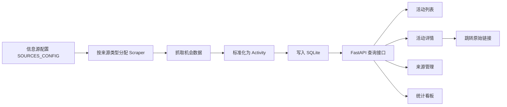
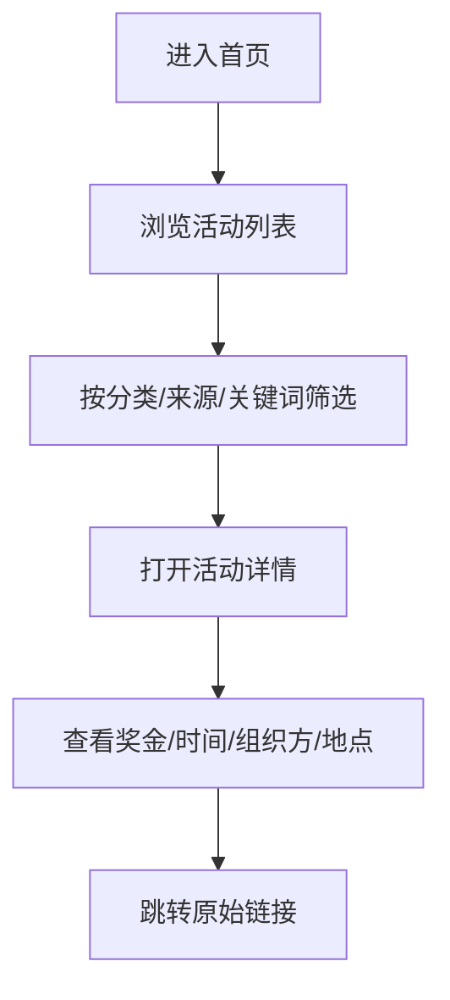
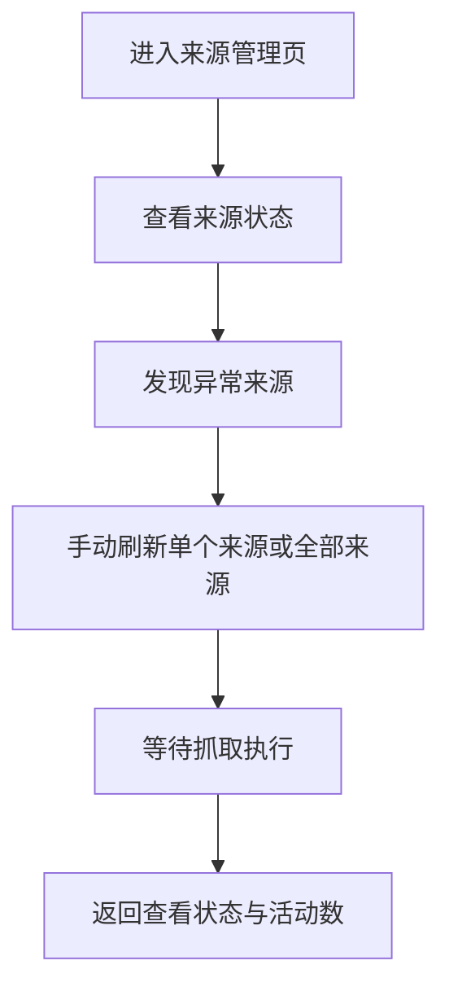

# VigilAI 当前业务逻辑与产品分析

## 1. 文档目的

本文基于当前项目代码与现有文档，对 VigilAI 的业务逻辑进行产品经理视角的系统拆解，重点回答 5 个问题：

1. 这个产品现在到底在做什么
2. 它的核心业务闭环是什么
3. 当前用户能完成哪些真实任务
4. PRD 里的理想状态和代码现状差在哪里
5. 下一阶段最值得投入的产品方向是什么

说明：

- 本文以当前仓库代码现状为准，不以 PRD 理想态为准
- 本文关注业务逻辑、产品结构、用户路径和成熟度判断，不做实现细节展开

---

## 2. 产品定位判断

### 2.1 一句话定义

VigilAI 当前最准确的产品定义，不是“报名/交易平台”，而是一个面向开发者与技术人群的机会情报聚合系统。

### 2.2 当前核心价值

从产品目标看，它解决的不是“如何完成机会”，而是“如何更早发现机会”。

当前核心价值可以归纳为 3 点：

- 信息差变现：更快发现高价值机会
- 聚合提效：把分散在不同平台的机会统一收口
- 初步筛选：通过分类、关键词、来源筛选，降低人工盯盘成本

### 2.3 当前不是在做什么

项目当前并不具备以下能力：

- 站内报名或站内转化闭环
- 个性化推荐或用户画像驱动分发
- 完整通知闭环
- 稳定自动巡检的“实时雷达”体验

因此，从产品阶段判断，它属于“机会聚合 MVP”，而不是“成熟的自动化情报平台”。

---

## 3. 业务逻辑总览

### 3.1 当前业务主链

### 3.2 当前真实运行方式

虽然产品文档和 README 都强调“自动调度、定时更新”，但当前代码启动时显式关闭了调度器，因此真实运行模式是：

这意味着产品定位上的“自动雷达”与当前交付态存在明显偏差。

---

## 4. 供给侧业务逻辑

### 4.1 来源规模

当前配置了 `142` 个来源。

按优先级分布：

- `high`: 50
- `medium`: 62
- `low`: 30

按抓取方式分布：

- `firecrawl`: 127
- `data_competition`: 4
- `government`: 3
- `bounty`: 2
- `rss`: 2
- `coding_competition`: 2
- `kaggle`: 1
- `design_competition`: 1

### 4.2 供给结构特征

从来源配置能看出项目当前有两个明显策略：

1. 先做广覆盖
2. 再做标准化归一

也就是说，这不是一个从单一垂类深耕起步的产品，而是一个先快速覆盖多个“搞钱机会”场景的聚合器。它覆盖的机会类型已经不局限于传统 hackathon，而是扩展到了：

- Hackathon
- 数据竞赛
- 编程竞赛
- Grant
- Bounty
- Airdrop
- Dev Event
- News
- Quest
- Testnet

### 4.3 供给结构偏向

按配置里的分类计数看，当前来源供给最偏向以下几类：

- `dev_event`: 33
- `grant`: 22
- `airdrop`: 18
- `bounty`: 15
- `hackathon`: 10

这说明产品虽然对外强调“开发者搞钱机会”，但供给结构已经开始从“比赛型机会”向“Web3 激励、资助、活动、任务型机会”外扩。

从 PM 视角，这本身不是问题，但它要求前后端分类体系必须同步升级，否则用户对产品的理解会越来越模糊。

### 4.4 供给侧关键风险

#### 风险 1：Firecrawl 依赖过重

`127 / 142` 个来源依赖 `firecrawl`，说明产品抓取能力高度依赖单一外部能力。

这会带来 3 个产品层面的风险：

- 成本风险：来源越多，调用成本越高
- 可用性风险：一旦外部服务波动，主能力会整体受损
- 同质化风险：大量来源都走同一抽取路径，字段质量会参差不齐

#### 风险 2：来源数量增长快于治理能力

当前项目已经有较大规模来源池，但用户侧能力仍停留在基础筛选。  
当来源数量继续增长时，如果没有更强的数据质量治理、分类治理、排序治理，新增来源不一定提升用户价值，反而可能增加噪音。

---

## 5. 数据流转逻辑

### 5.1 统一数据对象

所有来源最终会被标准化为 `Activity`。当前对象核心字段包括：

- 标题
- 描述
- 来源 ID / 来源名
- 原始链接
- 分类
- 标签
- 奖金
- 时间
- 地点
- 主办方
- 图片
- 状态

这套数据模型已经足以支撑一个基本可用的机会浏览产品。

### 5.2 当前去重逻辑

当前真正落地的去重规则是：

- 以 `source_id + url` 作为唯一约束去重

这意味着：

- 同一来源的同一链接不会重复入库
- 不同来源转发同一个活动时，无法合并成一个机会

从产品层面看，这会直接造成两个问题：

- 列表里可能出现“同一个活动在多个来源重复出现”
- 仪表盘上的数量可能高于用户真实感知的有效机会数

所以当前系统是“工程去重”，还不是“产品去重”。

### 5.3 当前查询逻辑

活动列表支持的核心能力是：

- 按分类筛选
- 按来源筛选
- 按状态筛选
- 按关键词搜索
- 按字段排序
- 分页

这使得产品已经具备“机会浏览器”的基本形态。

### 5.4 当前详情页逻辑

详情页会展示更完整的机会字段，并引导用户跳原始链接。  
这说明产品当前承担的是“信息筛选与前置判断”的角色，而不是承接最后的转化动作。

从产品价值链上看：

- 列表页负责筛
- 详情页负责判
- 原站负责转化

这是一条很典型的内容聚合产品路径。

---

## 6. 用户旅程分析

### 6.1 普通用户旅程

### 6.2 运营或维护者旅程

### 6.3 当前前端主导航的产品含义

前端主导航只有 3 个入口：

- 活动列表
- 信息源管理
- 仪表盘

这意味着当前产品的用户结构其实已经隐含分成两类：

- 机会消费者：主要使用活动列表和详情页
- 产品维护者/运营者：主要使用来源管理和仪表盘

从 PM 视角，这说明当前产品还带有明显的“内部工具 + 外部展示”混合属性。

### 6.4 当前用户体验的优势

- 首页直达活动列表，路径短
- 列表、详情、来源管理分工清晰
- 具备来源维度筛选，适合重度用户
- 具备来源状态展示，方便维护

### 6.5 当前用户体验的短板

- 没有收藏、订阅、关注、提醒，用户只能靠自己反复来刷
- 没有“高价值推荐”机制，用户仍需要人工判断
- 没有“我关心的领域”入口，缺少个性化起点
- 站内闭环很弱，用户价值停留在“看到”，还没有进入“跟进”

---

## 7. 当前页面职责拆解

| 页面 | 当前职责 | 业务价值 | 当前问题 |
|------|----------|----------|----------|
| 活动列表 | 汇总展示、筛选、排序、搜索 | 用户发现机会的主入口 | 排序语义存在偏差，分类体系承接不完整 |
| 活动详情 | 补充信息，辅助判断 | 帮用户决定要不要点出去 | `full_content` 未真正转化为前端价值 |
| 来源管理 | 看来源状态、手动刷新 | 维护抓取系统可用性 | 更像运维后台，不像用户产品 |
| 仪表盘 | 展示总量与分布 | 帮维护者感知系统运行情况 | 统计链路存在实现风险 |

---

## 8. 成熟度判断

### 8.1 当前属于哪个阶段

VigilAI 当前更接近下面这个阶段：

> “已完成机会聚合 MVP，具备抓取、存储、查询、展示的基本闭环，但尚未形成稳定、自动、可信的机会监控产品。”

### 8.2 为什么它已经是 MVP

因为它已经满足了一个最小可用产品最关键的 4 个条件：

- 有稳定的数据模型
- 有多个可用来源
- 有可浏览的前端
- 有基本的来源状态和刷新能力

### 8.3 为什么它还不是成熟产品

因为它还缺失成熟产品最关键的 4 个特征：

- 自动化稳定运行
- 数据质量与分类一致性
- 用户价值可沉淀
- 结果可信且可解释

---

## 9. PRD 与当前实现的差距

### 9.1 最大差距不是“功能没做完”，而是“定位承诺未完全兑现”

PRD 和 README 对外讲的是：

- 自动监控
- 定时更新
- 智能去重
- 用户偏好
- 通知推送
- 一站式机会发现

而当前代码真正稳定落地的是：

- 多来源抓取
- 数据标准化
- 基础列表展示
- 手动刷新
- 基础看板

### 9.2 差距清单

| 目标能力 | PRD 预期 | 当前现状 | 产品影响 |
|----------|---------|---------|----------|
| 自动刷新 | 定时自动调度 | 当前默认关闭调度器，主要依赖手动刷新 | “实时监控”定位被削弱 |
| 智能去重 | 支持相似标题、跨平台识别 | 当前主要是 `source_id + url` 去重 | 同活动重复出现的概率较高 |
| 分类体系 | 统一清晰的机会分类 | 配置里已有 `quest`、`testnet`，但前端未完整承接 | 用户认知和筛选能力会失真 |
| 来源类型治理 | 类型体系应一致 | 后端类型明显多于前端类型声明 | 长期维护成本和出错概率升高 |
| 详情价值 | 提供更充分的判断信息 | 后端已有 `full_content` 能力，前端未充分展示 | 详情页与列表页差异不足 |
| 统计看板 | 提供系统概览 | 当前统计链路存在接口实现风险 | 仪表盘可能不稳定 |
| 偏好与通知 | 支持用户偏好和推送 | 尚未进入当前产品主链 | 用户留存与主动触达弱 |
| 设置系统 | 用户可配置展示与订阅 | 当前主导航中无设置页 | 个性化能力缺席 |

### 9.3 还有两个隐性差距

#### 隐性差距 1：产品分类已经扩容，但心智模型没同步升级

随着 Quest、Testnet、Grant、Airdrop 等来源不断增加，产品已经不再只是“比赛信息聚合器”。  
它更像“开发者机会雷达”，但前端的分类与展示逻辑还停留在较早期的模式。

#### 隐性差距 2：产品越来越依赖数据治理，而不是继续堆来源

来源数已经不少，下一阶段用户价值提升的关键，不再是“再多接 20 个网站”，而是：

- 哪些机会值得优先看
- 哪些来源更可信
- 哪些活动重复出现了
- 哪些信息值得推送

---

## 10. 当前关键问题优先级

### 10.1 P0：必须先解决，否则产品定位站不住

#### P0-1 恢复并稳定自动刷新能力

原因：

- 产品对外承诺的是“自动监控”
- 当前实际是“手动刷新”
- 这会直接影响产品可信度与价值感知

目标：

- 恢复 scheduler
- 明确失败重试、暂停恢复、来源状态更新逻辑
- 让“数据新鲜度”成为可被依赖的能力

#### P0-2 修复统计链路

原因：

- 仪表盘是系统可信度的重要可视化入口
- 如果统计接口不稳定，运营层会失去系统感知能力

目标：

- 确保 stats 数据结构前后端一致
- 明确最近更新时间、最近新增量等核心指标定义

#### P0-3 统一分类体系

原因：

- 供给结构已经扩展到 quest、testnet 等新类型
- 前后端分类不统一，会直接损伤筛选与理解

目标：

- 后端枚举、前端类型、前端展示文案、筛选项统一
- 完整梳理一级分类与二级标签

#### P0-4 修复排序与筛选语义

原因：

- 列表页是主战场
- 一旦排序无效，高价值机会发现效率会明显下降

目标：

- 前后端统一排序字段命名
- 校验奖金、截止时间、更新时间排序逻辑是否真实生效

### 10.2 P1：提升用户价值密度

#### P1-1 做强详情页

目标：

- 把 `full_content` 真正展示出来
- 提炼更适合用户判断的摘要结构
- 明确报名时间、奖励结构、门槛、地点、组织方等关键信息

#### P1-2 升级来源管理页

当前来源管理页更像“手动刷新页面”。  
下一步应升级成“采集运维台”。

建议增加：

- 最近新增量
- 最近成功时间
- 连续失败次数
- 暂停状态提示
- 刷新耗时
- 成功率或稳定性指标

#### P1-3 做数据质量治理

重点不是新接更多来源，而是提升已接入来源的可用性。

建议方向：

- 相似活动识别
- 异常字段告警
- 来源可信度分级
- 数据完整度评分

### 10.3 P2：进入产品化与留存阶段

#### P2-1 用户偏好与订阅

让用户能选择：

- 我关心哪些类别
- 我关心哪些关键词
- 我不想看哪些来源

#### P2-2 通知推送

在数据质量和分类稳定后，再接入：

- 邮件
- 微信 / 钉钉
- Telegram

#### P2-3 收藏与跟踪

如果希望产品从“看过”走向“持续回访”，需要让用户有沉淀动作：

- 收藏活动
- 标记已参与
- 标记待跟进
- 创建个人机会池

---

## 11. 下一版本路线图建议

### 11.1 V1.1：把基础盘做稳

目标：

- 从“能用”变成“可信”

建议范围：

- 恢复自动调度
- 修复统计接口
- 统一分类枚举
- 修复排序语义
- 补齐来源状态可视化

成功标志：

- 用户或维护者不需要频繁手动兜底
- 列表结果与统计结果基本可信

### 11.2 V1.2：把用户判断效率做高

目标：

- 从“能看到”变成“能更快判断”

建议范围：

- 强化详情页结构
- 提升活动摘要质量
- 增加高价值机会优先展示逻辑
- 增加来源可信度或活动质量分层

成功标志：

- 用户能更快区分值得跟进和不值得跟进的机会

### 11.3 V1.3：把产品从工具变成服务

目标：

- 从“手动回来刷”变成“系统主动推给我”

建议范围：

- 用户偏好
- 关键词订阅
- 通知推送
- 收藏与机会池

成功标志：

- 用户开始形成持续使用习惯
- 产品具备留存与复访基础

---

## 12. 结论

### 12.1 当前最准确的产品判断

VigilAI 当前不是一个完整的“开发者搞钱平台”，而是一个已经具备雏形的“开发者机会雷达 / 情报聚合中台”。

### 12.2 当前最大的优点

- 来源覆盖广
- 数据模型已成型
- 前后台主链条已跑通
- 已具备进一步产品化的基础

### 12.3 当前最大的短板

- 自动化能力未真正落地
- 分类与类型体系有漂移
- 数据治理能力弱于来源扩张速度
- 用户价值仍停留在“看见”，还没有形成“持续跟进”

### 12.4 下一阶段最重要的事情

下一阶段最值得投入的，不是继续无上限加来源，而是先打通下面这条主链：

> 自动刷新 -> 稳定统计 -> 统一分类 -> 有效排序 -> 更强详情 -> 用户订阅

只要这条链打通，VigilAI 才会从“项目”开始变成“产品”。

---

## 13. 给项目负责人的一句建议

如果把这套系统当成产品来做，建议从现在开始，把“新增多少来源”降级为次优先级，把“数据可信度和用户决策效率”提升为第一优先级。

原因很简单：

- 来源多，不等于用户价值高
- 数据准、分类清、排序对，才是机会发现产品真正的竞争力

